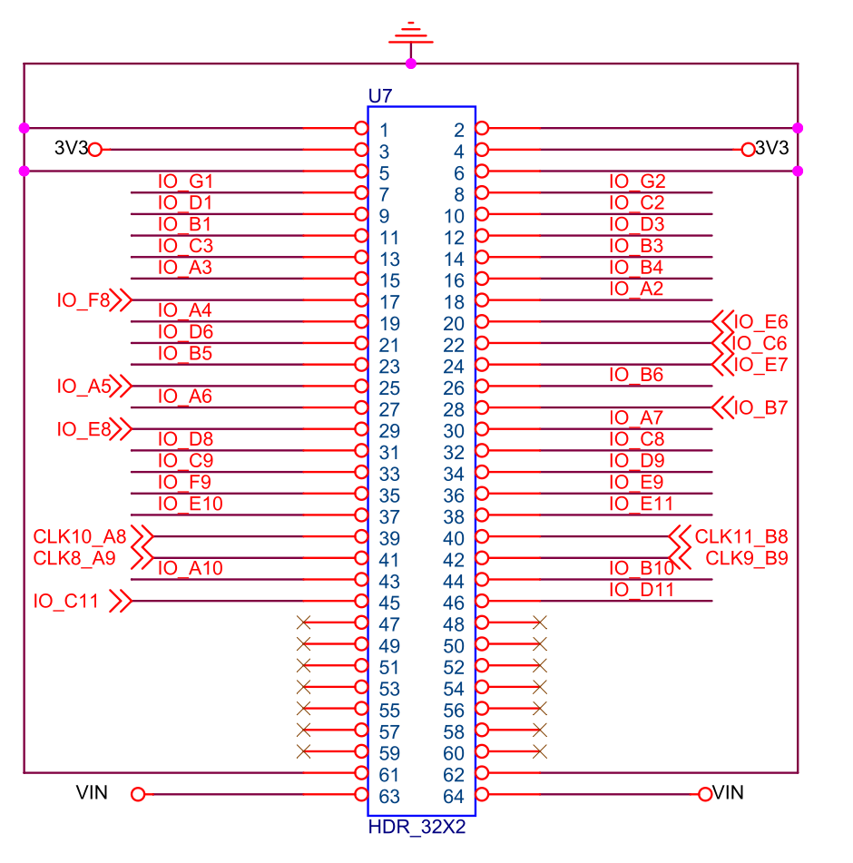
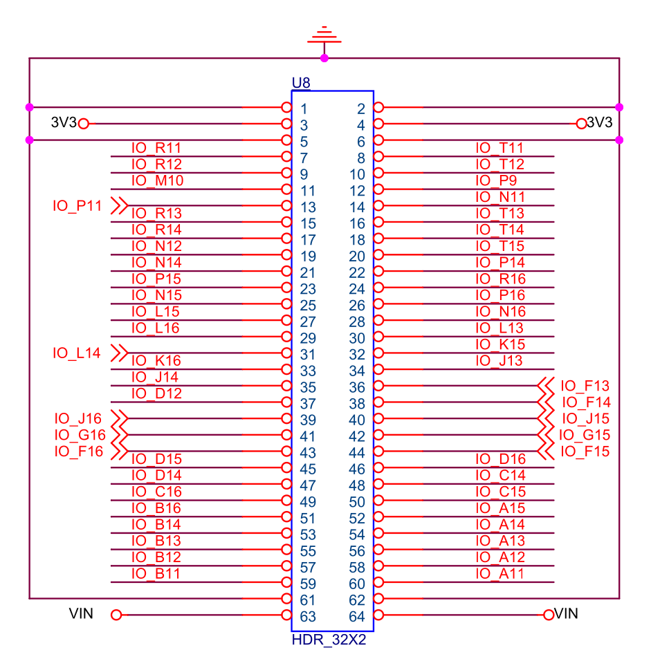

# QMTECH 10CL025 Core Board

## Overview

Compact, low-cost core board built around the Cyclone 10 LP 10CL025. Same
form factor and 64-pin header convention as the larger QMTECH boards
(EP4CGX150, [XC7A100T](qmtech-xc7a100t-board.md)), so it drops into the
same daughter boards but has roughly a sixth the logic and a tenth the
block RAM of the EP4CGX150.

GitHub: <https://github.com/ChinaQMTECH/QMTECH_Cyclone10_10CL006_025>

Schematic: [QMTECH_10CL025-SDRAM-CORE-BOARD-V1-20231109.pdf](https://github.com/ChinaQMTECH/QMTECH_Cyclone10_10CL006_025/blob/master/10CL025YU256/Hardware/QMTECH_10CL025-SDRAM-CORE-BOARD-V1-20231109.pdf)

User manuals:
[Core board user manual](https://github.com/ChinaQMTECH/QMTECH_Cyclone10_10CL006_025/blob/master/10CL025YU256/QMTECH_Cyclone10_10CL025_User_Manual(CoreBoard)-V01.pdf)
and
[Quartus 17.0 user manual](https://github.com/ChinaQMTECH/QMTECH_Cyclone10_10CL006_025/blob/master/10CL025YU256/QMTECH_Cyclone10_10CL025_User_Manual(CoreBoard)-V01.pdf).

## FPGA

- **Device**: Intel/Altera Cyclone 10 LP — 10CL025YU256I7G
- **Logic Elements**: 24,624
- **Block RAM**: 594 Kbit (66 M9K blocks)
- **Multipliers**: 66 (18x18) / 132 (9x9)
- **PLLs**: 4
- **Package**: 256-pin FBGA (U256)
- **Temperature**: Industrial (-40 to +100 C)
- **Speed grade**: 7
- **Core voltage**: 1.2V
- **I/O standard**: 3.3V LVCMOS / LVTTL (general purpose)

Compared with the EP4CGX150: ~1/6 the LEs, ~1/9 the block RAM, no GX
transceivers, 4 PLLs vs 6. Cyclone 10 LP is essentially a re-pin and
re-package of the Cyclone IV E family with the same M9K BRAM and DSP
primitives, so existing Cyclone IV designs port with only minor changes
(family string, PLL family, and a few `CYCLONEII_*` global assignments).

### Cyclone 10 LP gotchas

- **PIN_F16 is shared with `nCEO`** (chip-enable-output after configuration).
  To use it as a regular I/O, add:
  ```tcl
  set_global_assignment -name CYCLONEII_RESERVE_NCEO_AFTER_CONFIGURATION \
      "USE AS REGULAR IO"
  ```
  Without this, Quartus will silently refuse to drive the pin and any
  assignment to PIN_F16 errors with `multiple constant drivers`.

- **Reserve unused pins as input tri-stated with weak pull-up** to avoid
  driving the SDRAM or onboard pull-down nets when not used:
  ```tcl
  set_global_assignment -name RESERVE_ALL_UNUSED_PINS_WEAK_PULLUP \
      "AS INPUT TRI-STATED WITH WEAK PULL-UP"
  ```

- **Core LED port width**: the on-board core LED uses net name `led_core[0]`
  even though there is only one LED. Declare the port as `[0:0]` (not
  scalar, not `[1:0]`), otherwise Quartus silently auto-places on a free
  pin instead of PIN_N9.

## Clock

- **Oscillator**: 50 MHz (PIN_E2) — feeds a global clock buffer directly,
  not via the header
- **Reset button**: KEY1 push switch on PIN_F3 (active low)
- **PLLs**: 4 on-chip ALTPLL blocks, instantiated with
  `intended_device_family("Cyclone 10 LP")`. The four dedicated clock
  inputs are routed to header U7 pins 39-42
  (CLK10_A8, CLK11_B8, CLK8_A9, CLK9_B9).

## SDR SDRAM

**Component**: Winbond W9825G6JH-6 — 256 Mbit (32 MB), 16-bit data bus
(same chip as the EP4CGX150 core board).

| Parameter | Value |
|-----------|-------|
| Capacity | 256 Mbit (32 MB) |
| Data width | 16-bit |
| Row address | 13-bit (8192 rows) |
| Column address | 9-bit (512 columns) |
| Banks | 4 (2-bit bank address) |
| CAS latency | 2 (at 50 MHz) / 3 (at higher clocks) |
| Speed grade | -6 (6ns CAS, 166 MHz max) |
| I/O standard | 3.3V LVTTL |

**Address space**: 2^13 rows x 2^9 columns x 4 banks x 16 bits = 256 Mbit = 32 MB

### SDRAM Pin Assignments

From the QMTECH reference project `Test04_SDRAM.qsf`:

**SDRAM clock**: PIN_P2

**Control signals:**

| Signal | Pin |
|--------|-----|
| `DRAM_CS_N` | PIN_P8 |
| `DRAM_CKE` | PIN_R1 |
| `DRAM_WE_N` | PIN_P6 |
| `DRAM_RAS_N` | PIN_M8 |
| `DRAM_CAS_N` | PIN_M7 |

**Bank address:**

| Signal | Pin |
|--------|-----|
| `DRAM_BA[0]` | PIN_N8 |
| `DRAM_BA[1]` | PIN_L8 |

**Address bus [12:0]:**

| Signal | Pin |
|--------|-----|
| `DRAM_ADDR[0]` | PIN_R7 |
| `DRAM_ADDR[1]` | PIN_T7 |
| `DRAM_ADDR[2]` | PIN_T10 |
| `DRAM_ADDR[3]` | PIN_R10 |
| `DRAM_ADDR[4]` | PIN_R6 |
| `DRAM_ADDR[5]` | PIN_T5 |
| `DRAM_ADDR[6]` | PIN_R5 |
| `DRAM_ADDR[7]` | PIN_T4 |
| `DRAM_ADDR[8]` | PIN_R4 |
| `DRAM_ADDR[9]` | PIN_T3 |
| `DRAM_ADDR[10]` | PIN_T6 |
| `DRAM_ADDR[11]` | PIN_R3 |
| `DRAM_ADDR[12]` | PIN_T2 |

**Data mask:**

| Signal | Pin |
|--------|-----|
| `DRAM_LDQM` (DQM[0]) | PIN_N6 |
| `DRAM_UDQM` (DQM[1]) | PIN_P1 |

**Data bus [15:0]:**

| Signal | Pin |
|--------|-----|
| `DRAM_DQ[0]` | PIN_K5 |
| `DRAM_DQ[1]` | PIN_L3 |
| `DRAM_DQ[2]` | PIN_L4 |
| `DRAM_DQ[3]` | PIN_L7 |
| `DRAM_DQ[4]` | PIN_N3 |
| `DRAM_DQ[5]` | PIN_M6 |
| `DRAM_DQ[6]` | PIN_P3 |
| `DRAM_DQ[7]` | PIN_N5 |
| `DRAM_DQ[8]` | PIN_N2 |
| `DRAM_DQ[9]` | PIN_N1 |
| `DRAM_DQ[10]` | PIN_L1 |
| `DRAM_DQ[11]` | PIN_L2 |
| `DRAM_DQ[12]` | PIN_K1 |
| `DRAM_DQ[13]` | PIN_K2 |
| `DRAM_DQ[14]` | PIN_J1 |
| `DRAM_DQ[15]` | PIN_J2 |

### Other Pins

| Signal | Pin | Function | Designator |
|--------|-----|----------|------------|
| `sys_clk` | PIN_E2 | 50 MHz oscillator | Y1 |
| `sys_rst_n` | PIN_F3 | KEY1 push switch (active low) | KEY1 |
| `led_core[0]` | PIN_N9 | Core board LED | D5 |

There is only **one** user LED on the 10CL025 core board (vs two on the
EP4CGX150).

## Configuration and Boot

**JTAG programming**: USB-Blaster via JTAG header on core board.

**Flash boot**: EPCS16 serial configuration flash (2 MB — smaller than
the EPCS128 on the EP4CGX150).

## U7/U8 Connector Mapping

The U7 and U8 headers are 32x2 pin (64 pins each) at 0.1" pitch and use
the same GND/3V3/IO/VIN convention as the other QMTECH boards. U7 is the
half closest to the FPGA's bank-1/bank-2 side (which includes the
dedicated clock inputs); U8 is the half closest to the bank-5/bank-6
side. Header pin numbering is identical to the EP4CGX150 (pin 1-2 = GND,
3-4 = 3V3, 5-6 = GND, 7-60 = IO, 61-62 = GND, 63-64 = VIN).

From `Connectors.csv` in the QMTECH reference materials. `X` = not
connected (no FPGA I/O at that location on the U256 package).

**U7** (FPGA banks 1 / 2 -- clock side, partially populated):



Carries the four dedicated clock inputs (pins 39-42) plus 38 general I/O.
Pins 47-60 are not connected — the U256 package does not break out I/Os
in that region.

**U8** (FPGA banks 5 / 6 -- fully populated):



54 general-purpose I/Os.

| Pin | U7 | U8 |
|:---:|:----:|:----:|
| 1 | GND | GND |
| 2 | GND | GND |
| 3 | 3V3 | 3V3 |
| 4 | 3V3 | 3V3 |
| 5 | GND | GND |
| 6 | GND | GND |
| 7 | G1 | R11 |
| 8 | G2 | T11 |
| 9 | D1 | R12 |
| 10 | C2 | T12 |
| 11 | B1 | M10 |
| 12 | D3 | P9 |
| 13 | C3 | P11 |
| 14 | B3 | N11 |
| 15 | A3 | R13 |
| 16 | B4 | T13 |
| 17 | F8 | R14 |
| 18 | A2 | T14 |
| 19 | A4 | N12 |
| 20 | E6 | T15 |
| 21 | D6 | N14 |
| 22 | C6 | P14 |
| 23 | B5 | P15 |
| 24 | E7 | R16 |
| 25 | A5 | N15 |
| 26 | B6 | P16 |
| 27 | A6 | L15 |
| 28 | B7 | N16 |
| 29 | E8 | L16 |
| 30 | A7 | L13 |
| 31 | D8 | L14 |
| 32 | C8 | K15 |
| 33 | C9 | K16 |
| 34 | D9 | J13 |
| 35 | F9 | J14 |
| 36 | E9 | F13 |
| 37 | E10 | D12 |
| 38 | E11 | F14 |
| 39 | A8 (CLK10) | J16 |
| 40 | B8 (CLK11) | J15 |
| 41 | A9 (CLK8) | G16 |
| 42 | B9 (CLK9) | G15 |
| 43 | A10 | F16 (nCEO) |
| 44 | B10 | F15 |
| 45 | C11 | D15 |
| 46 | D11 | D16 |
| 47 | NC | D14 |
| 48 | NC | C14 |
| 49 | NC | C16 |
| 50 | NC | C15 |
| 51 | NC | B16 |
| 52 | NC | A15 |
| 53 | NC | B14 |
| 54 | NC | A14 |
| 55 | NC | B13 |
| 56 | NC | A13 |
| 57 | NC | B12 |
| 58 | NC | A12 |
| 59 | NC | B11 |
| 60 | NC | A11 |
| 61 | GND | GND |
| 62 | GND | GND |
| 63 | VIN | VIN |
| 64 | VIN | VIN |

Total available header I/O: ~40 pins on U7 (4 of which are dedicated
clock inputs) + 54 pins on U8 = ~94 I/O. By comparison the EP4CGX150
exposes 108 I/O on U4+U5.

PIN_F16 on U7 pin 43 requires `CYCLONEII_RESERVE_NCEO_AFTER_CONFIGURATION
"USE AS REGULAR IO"` to be usable — see the gotchas above.

## Reference Projects (QMTECH)

In the `10CL025YU256/Software/` folder of the
[upstream QMTECH repo](https://github.com/ChinaQMTECH/QMTECH_Cyclone10_10CL006_025):

| Project | Description |
|---------|-------------|
| Test01_LED | Single-LED blink, references PIN_E2 / PIN_F3 / PIN_N9 |
| Test04_SDRAM | W9825 SDRAM read/write self-test with SignalTap probe |
