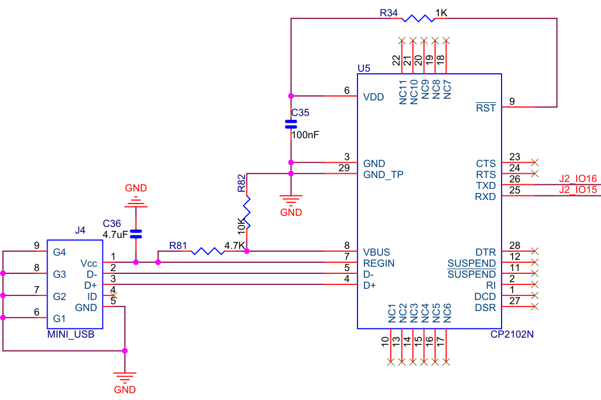
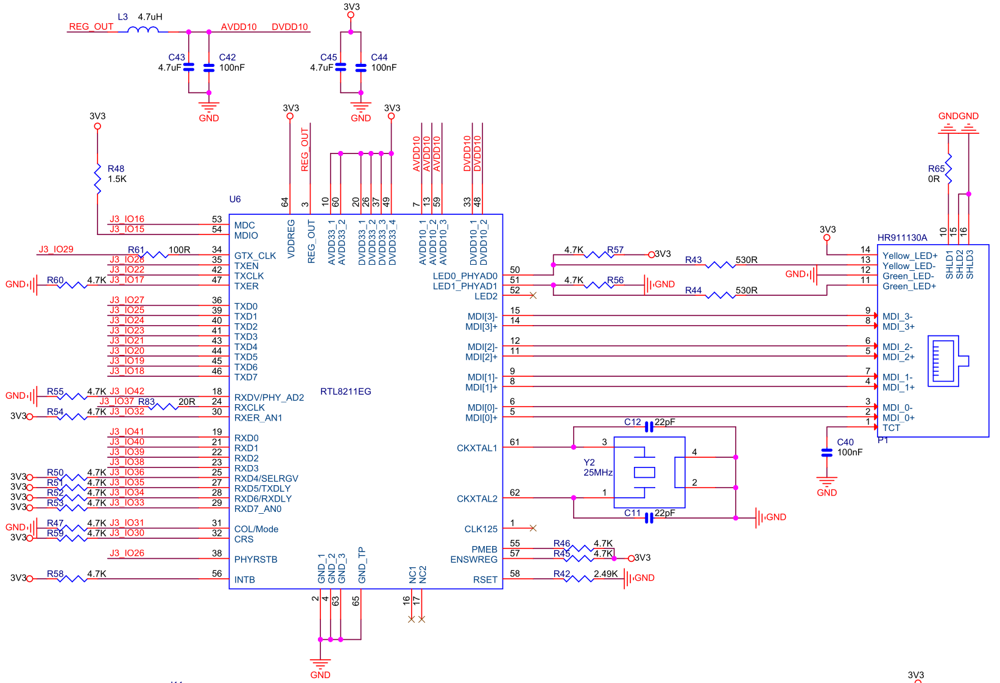
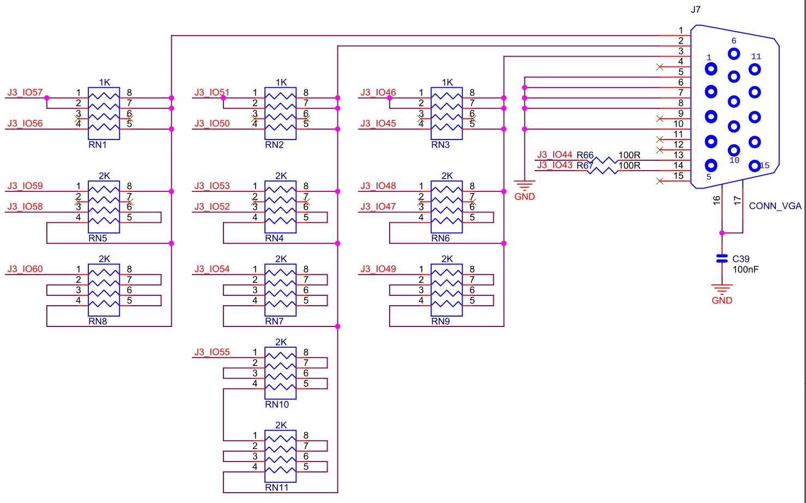
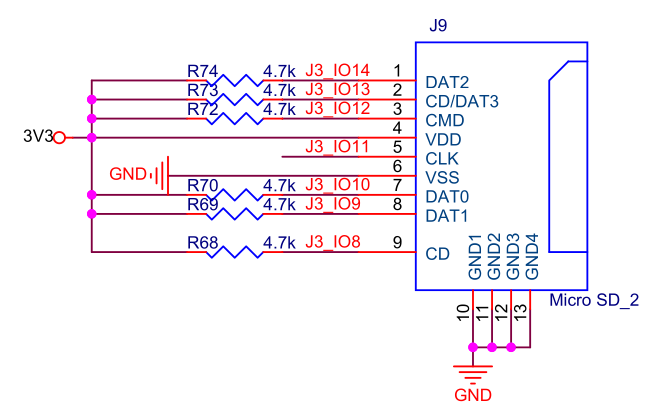
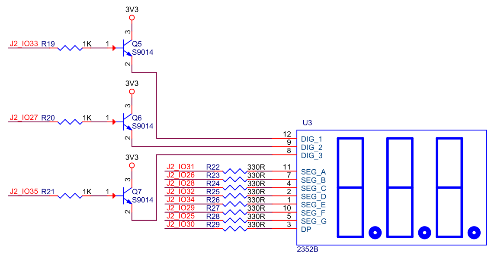
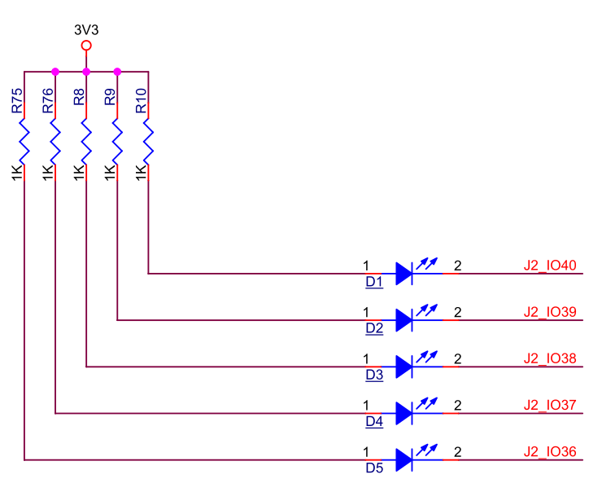
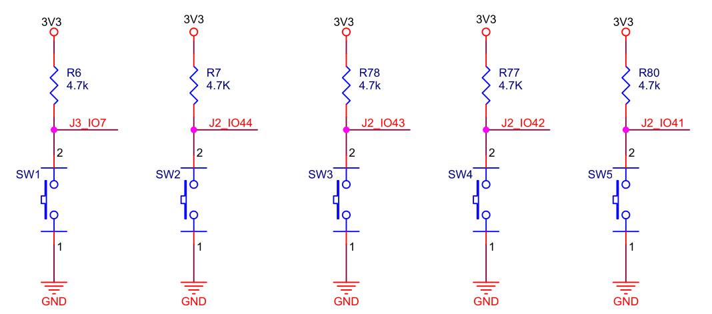
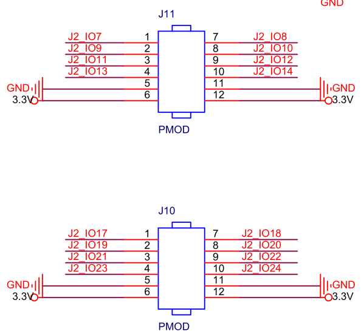
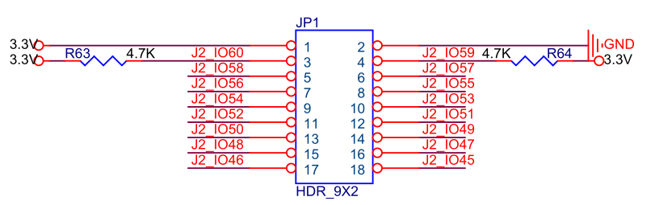

# QMTECH DB_FPGA V4

Daughter board for QMTECH FPGA core boards (V4 variant with CP2102N USB-UART).

Schematic: `QMTECH_DB_For_FPGA_V04.pdf` in `/srv/git/qmtech/DB_FPGA/`

Used with the **EP4CGX150** as the primary JOP platform.

See [DB_FPGA overview](qmtech-db-fpga.md) for version comparison.

## Peripherals

| Peripheral | Component | Connector | JOP component |
|------------|-----------|:---------:|---------------|
| UART | CP2102N USB-to-UART, Mini USB → `/dev/ttyUSB0` | J2:13/14 | `BmbUart` (up to 2 Mbaud) |
| Ethernet | RTL8211EG PHY, GMII 8-bit | J3 | `BmbEth` + `BmbMdio` |
| VGA | Direct RGB 5-6-5, 15-pin D-sub | J3 | `BmbVgaText` (80×30) |
| SD card | microSD, native 4-bit / SPI | J3 | `BmbSdNative` / `BmbSdSpi` |
| 7-segment | 3-digit 2352B, multiplexed | J2 | — |
| LEDs | 5× active-low (LED2-6) | J2 | — |
| Buttons | SW1 (J3) + SW2-SW5 (J2), active-low, FPGA-accessible | J2/J3 | — |
| PMOD | J10, J11 (12-pin each), JP1 (18-pin) | J2 | — |

## Pin Assignments

`Jx_IO N` net name = physical Jx pin N. Pin resolution: DB_FPGA pin → core board connector pin → FPGA pin.

### UART (CP2102N, on J2)

| Signal | J2 Pin | EP4CGX150 | XC7A100T |
|--------|:------:|:---------:|:--------:|
| TXD (bridge → FPGA RX) | 13 | AD20 | F22 |
| RXD (FPGA TX → bridge) | 14 | AE21 | G22 |

### Ethernet (RTL8211EG, GMII) — on J3

**Management:**

| Signal | J3 Pin | EP4CGX150 | XC7A100T |
|--------|:------:|:---------:|:--------:|
| MDC | 14 | A20 | B2 |
| MDIO | 13 | A21 | C2 |
| RESET_N | 24 | A15 | F4 |

**Transmit path:**

| Signal | J3 Pin | EP4CGX150 | XC7A100T |
|--------|:------:|:---------:|:--------:|
| GTX_CLK | 27 | C13 | J4 |
| TX_CLK | 20 | B17 | D1 |
| TX_EN | 26 | C14 | G1 |
| TX_ER | 15 | A19 | E5 |
| TXD[0] | 25 | C15 | G2 |
| TXD[1] | 23 | B15 | G4 |
| TXD[2] | 22 | A16 | E2 |
| TXD[3] | 21 | A17 | F2 |
| TXD[4] | 19 | C16 | E1 |
| TXD[5] | 18 | B18 | B1 |
| TXD[6] | 17 | C17 | C1 |
| TXD[7] | 16 | A18 | D5 |

**Receive path:**

| Signal | J3 Pin | EP4CGX150 | XC7A100T |
|--------|:------:|:---------:|:--------:|
| RX_CLK | 35 | B10 | L5 |
| RX_DV | 40 | A8 | N2 |
| RX_ER | 30 | C11 | H1 |
| RXD[0] | 39 | A9 | N3 |
| RXD[1] | 38 | B9 | L4 |
| RXD[2] | 37 | C10 | M4 |
| RXD[3] | 36 | A10 | K5 |
| RXD[4] | 34 | A11 | L2 |
| RXD[5] | 33 | B11 | M2 |
| RXD[6] | 32 | A12 | G9 |
| RXD[7] | 31 | A13 | H9 |

GMII TX requires 125 MHz clock on GTX_CLK (FPGA PLL). RX_CLK is source-synchronous from PHY.

### VGA (RGB 5-6-5) — on J3

| Signal | J3 Pin | EP4CGX150 | XC7A100T |
|--------|:------:|:---------:|:--------:|
| HS | 42 | A6 | M5 |
| VS | 41 | A7 | M6 |
| R[4] | 55 | D1 | T2 |
| R[3] | 54 | B1 | P1 |
| R[2] | 57 | E2 | U2 |
| R[1] | 56 | C1 | R2 |
| R[0] | 58 | E1 | U1 |
| G[5] | 49 | C5 | P6 |
| G[4] | 48 | A4 | T3 |
| G[3] | 51 | A3 | N1 |
| G[2] | 50 | C4 | P5 |
| G[1] | 52 | A2 | M1 |
| G[0] | 53 | B2 | R1 |
| B[4] | 44 | B6 | J1 |
| B[3] | 43 | B7 | K1 |
| B[2] | 46 | A5 | P3 |
| B[1] | 45 | B5 | R3 |
| B[0] | 47 | B4 | T4 |

Pixel clock: 25 MHz for 640×480@60 Hz (FPGA PLL).

### SD Card (Native 4-bit / SPI) — on J3

| Signal | J3 Pin | EP4CGX150 | XC7A100T | Native | SPI |
|--------|:------:|:---------:|:--------:|--------|-----|
| CLK | 9 | B21 | A3 | SD_CLK | SPI_CLK |
| CMD | 10 | A22 | A2 | CMD | MOSI |
| DAT[0] | 8 | A23 | A4 | DAT0 | MISO |
| DAT[1] | 7 | B23 | B4 | DAT1 | — |
| DAT[2] | 12 | B19 | C4 | DAT2 | — |
| DAT[3] | 11 | C19 | D4 | DAT3/CS | CS |
| CD | 6 | B22 | A5 | Detect | Detect |

Note: SD CD (J3:6) shares its FPGA pin with V5 RP2040 UART0 RX (J3:8) — no conflict on V4.

### 7-Segment Display (3-digit 2352B, active-low) — on J2

| Signal | J2 Pin | EP4CGX150 | XC7A100T |
|--------|:------:|:---------:|:--------:|
| Segment A | 29 | AF15 | L23 |
| Segment B | 24 | AD18 | K25 |
| Segment C | 26 | AF17 | K22 |
| Segment D | 30 | AF16 | L22 |
| Segment E | 32 | AD16 | R26 |
| Segment F | 27 | AC17 | M26 |
| Segment G | 23 | AC18 | K26 |
| Decimal point | 28 | AD17 | N26 |
| Digit 1 sel | 33 | AE14 | M25 |
| Digit 2 sel | 25 | AE17 | K23 |
| Digit 3 sel | 31 | AC16 | P26 |

### LEDs (active-low) — on J2

| Signal | J2 Pin | EP4CGX150 | XC7A100T |
|--------|:------:|:---------:|:--------:|
| LED[2] | 38 | AD14 | P23 |
| LED[3] | 37 | AC14 | P24 |
| LED[4] | 36 | AD15 | N21 |
| LED[5] | 35 | AC15 | N22 |
| LED[6] | 34 | AE15 | M24 |

### Buttons (active-low) — SW1 on J3, SW2-SW5 on J2

| Signal | Pin | EP4CGX150 | XC7A100T |
|--------|:---:|:---------:|:--------:|
| SW1 | J3:5 | C21 | B5 |
| SW2 | J2:40 | AF12 | R25 |
| SW3 | J2:42 | AD10 | T24 |
| SW4 | J2:44 | AF9 | U21 |
| SW5 | J2:46 | AF8 | V23 |

### PMOD J10 (12-pin, 2×6) — on J2

| PMOD Pin | J2 Pin | EP4CGX150 | XC7A100T |
|:--------:|:------:|:---------:|:--------:|
| 1 | 15 | AF20 | J26 |
| 2 | 17 | AE19 | G21 |
| 3 | 19 | AC19 | H22 |
| 4 | 21 | AE18 | J21 |
| 7 | 16 | AF21 | J25 |
| 8 | 18 | AF19 | G20 |
| 9 | 20 | AD19 | H21 |
| 10 | 22 | AF18 | K21 |

Pins 5/6 = GND, 11/12 = 3.3V. No peripheral conflicts.

### PMOD J11 (12-pin, 2×6) — on J2

| PMOD Pin | J2 Pin | EP4CGX150 | XC7A100T |
|:--------:|:------:|:---------:|:--------:|
| 1 | 5 | AF24 | D26 |
| 2 | 7 | AC21 | D25 |
| 3 | 9 | AE23 | G26 |
| 4 | 11 | AE22 | E23 |
| 7 | 6 | AF25 | E26 |
| 8 | 8 | AD21 | E25 |
| 9 | 10 | AF23 | H26 |
| 10 | 12 | AF22 | F23 |

Pins 5/6 = GND, 11/12 = 3.3V. No peripheral conflicts.

### JP1 GPIO Header (18-pin, 2×9) — on J2

| JP1 Pin | J2 Pin | EP4CGX150 | XC7A100T |
|:-------:|:------:|:---------:|:--------:|
| 1 | — | 3.3V | 3.3V |
| 2 | — | GND | GND |
| 3 | 58 | AD4 | AB26 |
| 4 | 57 | AC4 | AC26 |
| 5 | 56 | AE3 | W25 |
| 6 | 55 | AD3 | Y26 |
| 7 | 54 | AF5 | W21 |
| 8 | 53 | AF4 | Y21 |
| 9 | 52 | AD6 | AB24 |
| 10 | 51 | AD5 | AC24 |
| 11 | 50 | AE6 | Y25 |
| 12 | 49 | AE5 | AA25 |
| 13 | 48 | AF6 | Y22 |
| 14 | 47 | AE7 | Y23 |
| 15 | 46 | AF8 | V23 |
| 16 | 45 | AF7 | W23 |
| 17 | 44 | AF9 | U21 |
| 18 | 43 | AE9 | V21 |

Pins 3/4 have 4.7K pull-ups. No peripheral conflicts (VGA is on J3).

## Power

- 3.3V from core board via headers
- Ethernet PHY: 1.0V + 3.3V analog, 100 nF decoupling, 4.7 µF bulk
- 4.7 kΩ pull-ups on MDIO
- 330 Ω current-limiting on LEDs
