# QMTECH DB_FPGA Daughter Board

## Overview

Universal daughter board for QMTECH FPGA core boards. Connects via dual 32x2 pin
headers (J2, J3) at 0.1" pitch. Confirmed compatible with:

- **QMTECH EP4CGX150** (Cyclone IV GX) — primary JOP platform
- **QMTECH EP4CE15** (Cyclone IV E) — has example projects for all peripherals
- **QMTECH XC7A75T/100T/200T** (Artix-7) — JOP DDR3 + DB_FPGA platform (presets defined)

GitHub: <https://github.com/ChinaQMTECH/DB_FPGA>

Reference files: `/srv/git/qmtech/DB_FPGA/`

Schematic: `QMTECH_DB_For_FPGA_V04.pdf` (V04, CP2102N USB-UART)
Enhanced version: `/srv/git/qmtech/DB_FPGA_with_RP2040/DB_FPGA_V5-20221108.pdf` (V05, RP2040 replaces CP2102N)

### V5 RP2040 Firmware

The V5 with a DirtyJTAG + UART composite USB device on the RP2040:
- **USB ID**: `1209:c0ca` (Generic Jean THOMAS DirtyJTAG)
- **JTAG**: DirtyJTAG interface for OpenOCD / openFPGALoader
- **UART**: CDC ACM serial port (`/dev/ttyACM0`)
- UART0: RP2040 GPIO0 (TX) / GPIO1 (RX) on J3 (J3_IO7/IO8)
- Maps to core board J3 pins **5/6** (not 7/8 — header mirroring between boards)
- UART0 XC7A100T: TX->B5, RX->A5 (verified). EP4CGX150: TX->C21, RX->B22
- UART1 (`/dev/ttyACM1`): GPIO4/5 -> J2 pins 40/39 (J2_IO42/IO41)
- UART1 does NOT conflict with Ethernet (Ethernet is on J3, not J2)
- **Not** J2:13/14 like V4's CP2102N — different connector and different pins!
- `dsrdtr=True` and `dtr=True` required when opening `/dev/ttyACM0`
- Verified working by FPGA pin loopback test

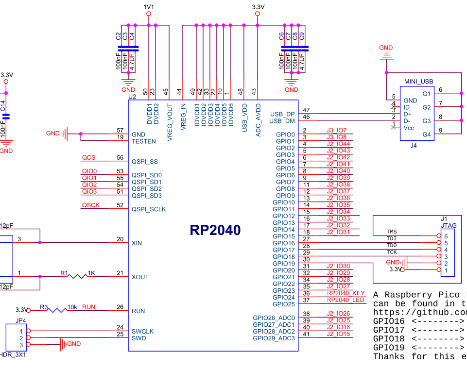

**Programming**: `sudo openFPGALoader -c dirtyJtag design.bit`

**RP2040 GPIO to FPGA connector mapping** (from DB_FPGA V5 schematic; NB schematic wiring note for JTAG is incorrect).
IO signal numbers have a +2 offset from physical pin numbers (e.g., J3_IO7 = J3 pin 5, verified by loopback).

| RP2040 | DB_FPGA Signal | Pin | Function | Conflicts with |
|:------:|:--------------:|:---:|----------|----------------|
| GPIO0 | J3_IO7 | J3:5 | UART0_TX | — |
| GPIO1 | J3_IO8 | J3:6 | UART0_RX | SD CD |
| GPIO2 | J2_IO44 | J2:42 | | — |
| GPIO3 | J2_IO43 | J2:41 | | — |
| GPIO4 | J2_IO42 | J2:40 | UART1_TX | — |
| GPIO5 | J2_IO41 | J2:39 | UART1_RX | — |
| GPIO6 | J2_IO40 | J2:38 | | LED[2] |
| GPIO7 | J2_IO39 | J2:37 | | LED[3] |
| GPIO8 | J2_IO38 | J2:36 | | LED[4] |
| GPIO9 | J2_IO37 | J2:35 | | LED[5] |
| GPIO10 | J2_IO36 | J2:34 | | LED[6] |
| GPIO11 | J2_IO35 | J2:33 | | 7SEG SEL0 |
| GPIO12 | J2_IO34 | J2:32 | | 7SEG E |
| GPIO13 | J2_IO33 | J2:31 | | 7SEG SEL2 |
| GPIO14 | J2_IO32 | J2:30 | | 7SEG D |
| GPIO15 | J2_IO31 | J2:29 | | 7SEG A |
| GPIO16 | J1_5 | — | JTAG TDI | — |
| GPIO17 | J1_4 | — | JTAG TDO | — |
| GPIO18 | J1_3 | — | JTAG TCK | — |
| GPIO19 | J1_6 | — | JTAG TMS | — |
| GPIO20 | J2_IO30 | J2:28 | | 7SEG DP |
| GPIO21 | J2_IO29 | J2:27 | | 7SEG F |
| GPIO22 | J2_IO28 | J2:26 | | 7SEG C |
| GPIO23 | J2_IO27 | J2:25 | | 7SEG SEL1 |
| GPIO24 | — | — | RP2040_KEY | — |
| GPIO25 | — | — | RP2040_LED | — |
| GPIO26_ADC0 | J2_IO26 | J2:24 | | 7SEG B |
| GPIO27_ADC1 | J2_IO25 | J2:23 | | 7SEG G |
| GPIO28_ADC2 | J2_IO16 | J2:14 | | CP2102N RXD (V4) |
| GPIO29_ADC3 | J2_IO15 | J2:13 | | CP2102N TXD (V4) |

GPIO6-15 and GPIO20-23/26-27 conflict with V4 7-segment display and LEDs (removed on V5). GPIO28-29 conflict with V4 CP2102N UART (replaced by RP2040 on V5). No Ethernet conflicts on J2 — Ethernet is on J3.

**Firmware**: `pico-dirtyJtag` with `BOARD_PICO` config (`CDC_UART_INTF_COUNT=2`).
Source: `/home/peter/pico-dirtyJtag/dirtyJtagConfig.h`

## Connector Overview

The DB_FPGA has two 32x2 pin headers (J2, J3) that mate with the FPGA core board's
expansion connectors. All peripherals are routed to one of these two connectors.

**Pin numbering convention**: Physical pins 5-58 are signal pins (pins 1-4 are
power/GND, 59+ are NC/VIN). DB_FPGA IO signal numbers = physical pin number + 2
(e.g., physical pin 5 = IO7, physical pin 14 = IO16, physical pin 58 = IO60).

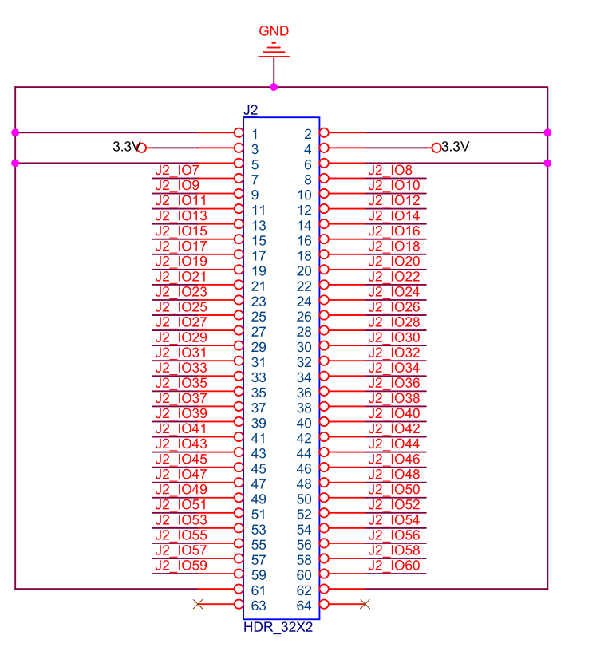

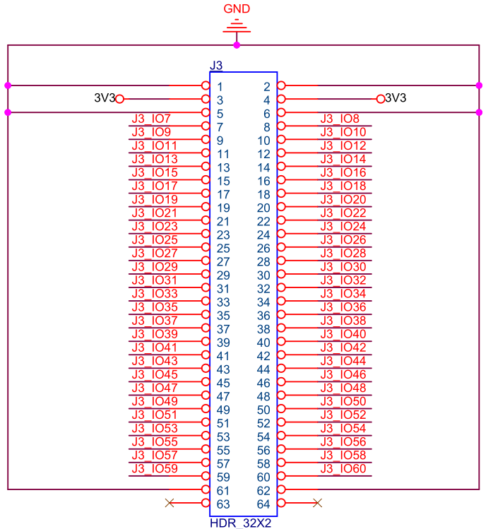

**J2 peripherals**: CP2102N UART (V4), 7-segment display (V4), LEDs (V4), PMODs J10/J11, Switches SW2-SW5 (V4)

**J3 peripherals**: Ethernet (RTL8211EG), VGA, SD Card, Switch SW1 (V4)

## Peripherals

| Peripheral | Component | Interface | Connector | Status in JOP |
|------------|-----------|-----------|:---------:|--------------|
| **Ethernet** | RTL8211EG PHY | GMII 8-bit (1 Gbps) | J3 | Working — `BmbEth` + `BmbMdio` |
| **UART** | CP2102N USB-to-UART (V4) / RP2040 (V5) | TX/RX + USB | J2 (V4) / J3 (V5) | Working — `BmbUart` (2 Mbaud) |
| **VGA** | Direct RGB (5-6-5) | 15-pin D-sub | J3 | Working — `BmbVgaText` (80x30) |
| **SD card** | microSD slot | Native 4-bit / SPI | J3 | Working — `BmbSdNative` / `BmbSdSpi` |
| **7-segment** | 3-digit (2352B) | Multiplexed 8+3 lines | J2 | V4 only (removed in V5) |
| **PMOD** | J10, J11 connectors | 12-pin GPIO each | J2 | Available for expansion |

## Pin Assignments

Peripheral signals mapped to connector pins (J2, J3) with FPGA pin assignments
for each supported core board. The connector pinout is identical across all
QMTECH core boards — only the FPGA pin changes per board.

### UART

V4 (CP2102N) on J2 and V5 (RP2040) on J3 use **different** connector pins.

| Signal | Pin | EP4CGX150 | XC7A100T | Version |
|--------|:---:|:---------:|:--------:|:-------:|
| TXD (to FPGA) | J2:13 | AD20 | F22 | V4 |
| RXD (from FPGA) | J2:14 | AE21 | G22 | V4 |
| TXD (to FPGA) | J3:5 | C21 | B5 | V5 |
| RXD (from FPGA) | J3:6 | B22 | A5 | V5 |

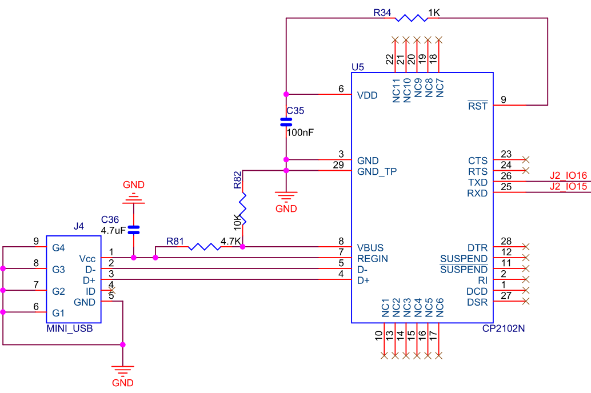

### Ethernet (RTL8211EG, GMII) — on J3

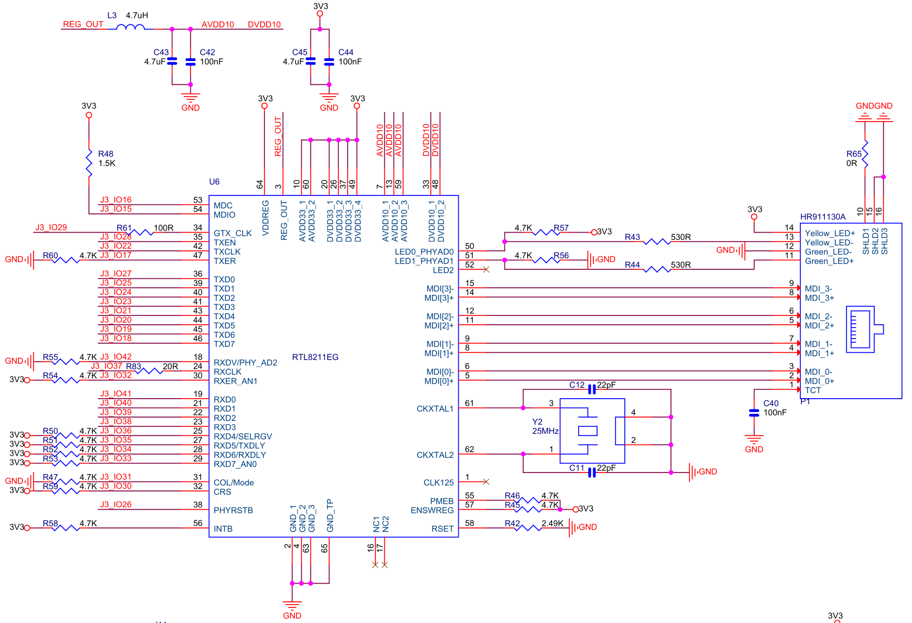

**Management:**

| Signal | Pin | EP4CGX150 | XC7A100T |
|--------|:---:|:---------:|:--------:|
| MDC | J3:14 | A20 | B2 |
| MDIO | J3:13 | A21 | C2 |
| RESET_N | J3:24 | A15 | F4 |

**Transmit path:**

| Signal | Pin | EP4CGX150 | XC7A100T |
|--------|:---:|:---------:|:--------:|
| GTX_CLK | J3:27 | C13 | J4 |
| TX_CLK | J3:20 | B17 | D1 |
| TX_EN | J3:26 | C14 | G1 |
| TX_ER | J3:15 | A19 | E5 |
| TXD[0] | J3:25 | C15 | G2 |
| TXD[1] | J3:23 | B15 | G4 |
| TXD[2] | J3:22 | A16 | E2 |
| TXD[3] | J3:21 | A17 | F2 |
| TXD[4] | J3:19 | C16 | E1 |
| TXD[5] | J3:18 | B18 | B1 |
| TXD[6] | J3:17 | C17 | C1 |
| TXD[7] | J3:16 | A18 | D5 |

**Receive path:**

| Signal | Pin | EP4CGX150 | XC7A100T |
|--------|:---:|:---------:|:--------:|
| RX_CLK | J3:35 | B10 | L5 |
| RX_DV | J3:40 | A8 | N2 |
| RX_ER | J3:30 | C11 | H1 |
| RXD[0] | J3:39 | A9 | N3 |
| RXD[1] | J3:38 | B9 | L4 |
| RXD[2] | J3:37 | C10 | M4 |
| RXD[3] | J3:36 | A10 | K5 |
| RXD[4] | J3:34 | A11 | L2 |
| RXD[5] | J3:33 | B11 | M2 |
| RXD[6] | J3:32 | A12 | G9 |
| RXD[7] | J3:31 | A13 | H9 |

GMII TX requires a 125 MHz clock on GTX_CLK (generated by FPGA PLL).
RX clock (RX_CLK) is source-synchronous from the PHY at 125 MHz.
See [DB_FPGA Ethernet](../peripherals/db-fpga-ethernet.md) for timing constraints and PHY config.

### VGA (RGB 5-6-5) — on J3

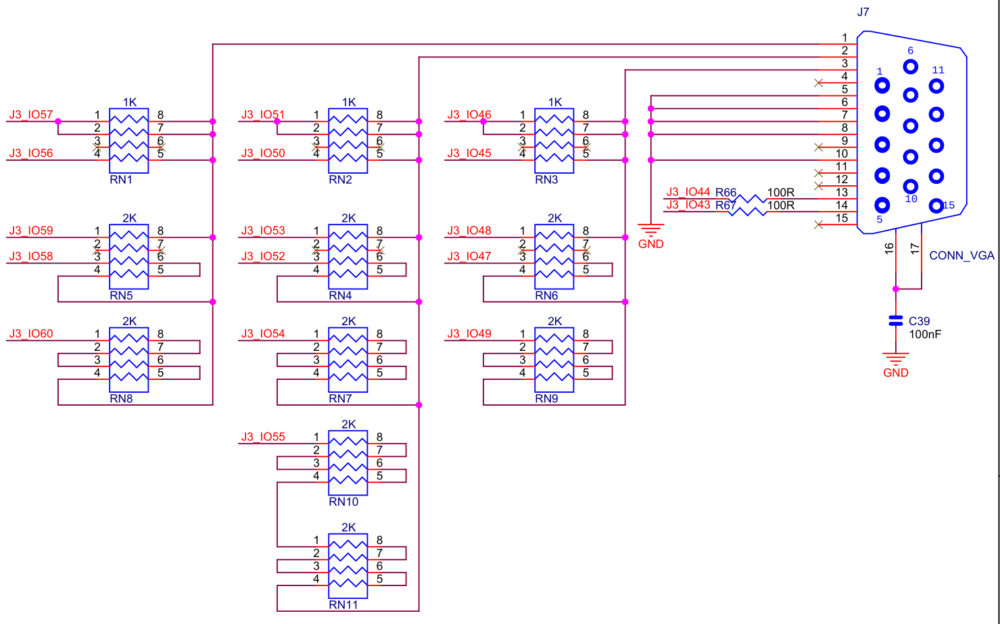

| Signal | Pin | EP4CGX150 | XC7A100T |
|--------|:---:|:---------:|:--------:|
| HS | J3:42 | A6 | M5 |
| VS | J3:41 | A7 | M6 |
| R[4] | J3:55 | D1 | T2 |
| R[3] | J3:54 | B1 | P1 |
| R[2] | J3:57 | E2 | U2 |
| R[1] | J3:56 | C1 | R2 |
| R[0] | J3:58 | E1 | U1 |
| G[5] | J3:49 | C5 | P6 |
| G[4] | J3:48 | A4 | T3 |
| G[3] | J3:51 | A3 | N1 |
| G[2] | J3:50 | C4 | P5 |
| G[1] | J3:52 | A2 | M1 |
| G[0] | J3:53 | B2 | R1 |
| B[4] | J3:44 | B6 | J1 |
| B[3] | J3:43 | B7 | K1 |
| B[2] | J3:46 | A5 | P3 |
| B[1] | J3:45 | B5 | R3 |
| B[0] | J3:47 | B4 | T4 |

Pixel clock (25 MHz for 640x480@60Hz) from PLL.
See [DB_FPGA VGA Text](../peripherals/db-fpga-vga-text.md) for register map and Java API.

### SD Card (Native 4-bit / SPI) — on J3

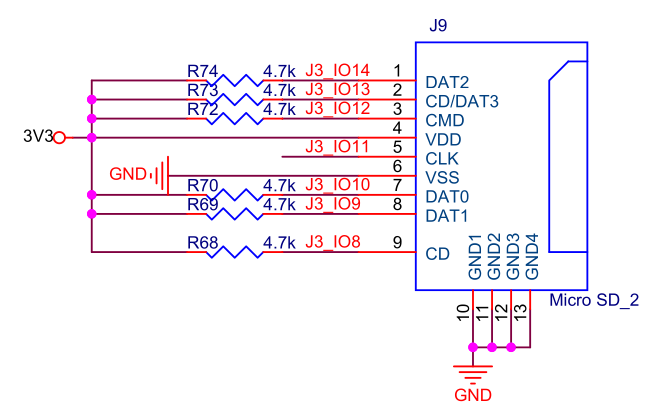

| Signal | Pin | EP4CGX150 | XC7A100T | Native | SPI |
|--------|:---:|:---------:|:--------:|--------|-----|
| CLK | J3:9 | B21 | A3 | SD_CLK | SPI_CLK |
| CMD | J3:10 | A22 | A2 | CMD | MOSI |
| DAT[0] | J3:8 | A23 | A4 | DAT0 | MISO |
| DAT[1] | J3:7 | B23 | B4 | DAT1 | — |
| DAT[2] | J3:12 | B19 | C4 | DAT2 | — |
| DAT[3] | J3:11 | C19 | D4 | DAT3/CS | CS |
| CD | J3:6 | B22 | A5 | Detect | Detect |

See [DB_FPGA SD Card](../peripherals/db-fpga-sd-card.md) for native mode details.

### 7-Segment Display (V4 only, 3-digit, active low) — on J2

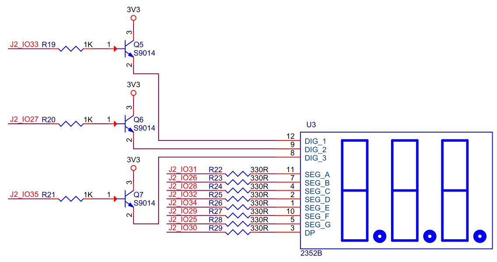

| Signal | Pin | EP4CGX150 | XC7A100T |
|--------|:---:|:---------:|:--------:|
| Segment A | J2:29 | AF15 | L23 |
| Segment B | J2:24 | AD18 | K25 |
| Segment C | J2:26 | AF17 | K22 |
| Segment D | J2:30 | AF16 | L22 |
| Segment E | J2:32 | AD16 | R26 |
| Segment F | J2:27 | AC17 | M26 |
| Segment G | J2:23 | AC18 | K26 |
| Decimal point | J2:28 | AD17 | N26 |
| Digit 1 sel | J2:33 | AE14 | M25 |
| Digit 2 sel | J2:25 | AE17 | K23 |
| Digit 3 sel | J2:31 | AC16 | P26 |

### LEDs (V4 only, active low) — on J2

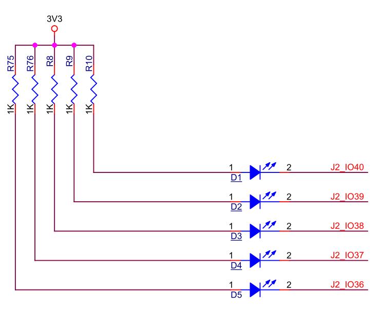

| Signal | Pin | EP4CGX150 | XC7A100T |
|--------|:---:|:---------:|:--------:|
| LED[2] | J2:38 | AD14 | P23 |
| LED[3] | J2:37 | AC14 | P24 |
| LED[4] | J2:36 | AD15 | N21 |
| LED[5] | J2:35 | AC15 | N22 |
| LED[6] | J2:34 | AE15 | M24 |

**V5**: Only the RP2040 onboard LED (GPIO25). No FPGA-accessible LEDs on the daughter board.

### Buttons / Switches

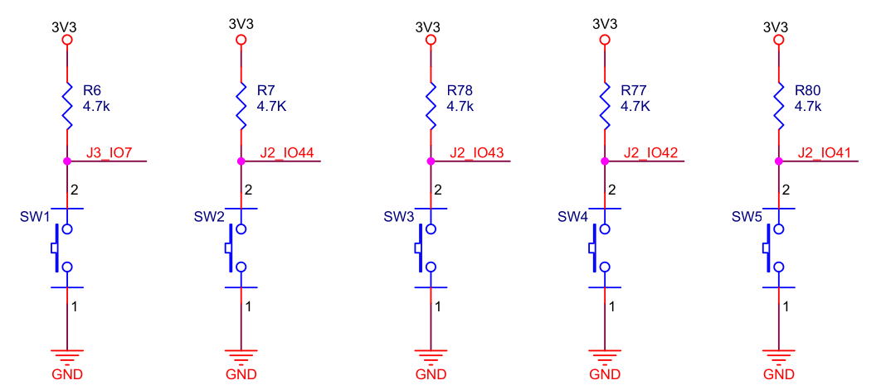

**V4**: 5 push buttons (active low). SW1 is on J3, SW2-SW5 are on J2:

| Signal | Pin | EP4CGX150 | XC7A100T |
|--------|:---:|:---------:|:--------:|
| SW1 | J3:5 | C21 | B5 |
| SW2 | J2:40 | AF12 | R25 |
| SW3 | J2:42 | AD10 | T24 |
| SW4 | J2:44 | AF9 | U21 |
| SW5 | J2:46 | AF8 | V23 |

Note: SW1 (J3_IO7) shares its pin with RP2040 UART0 TX on V5.

**V5**: Two RP2040 buttons only (not FPGA-accessible):

| Button | Function |
|--------|----------|
| SW1 | RP2040 Boot Select (BOOTSEL) |
| SW2 | RP2040 RUN (reset) |

### PMOD J10 (12-pin, 2x6, on J2)

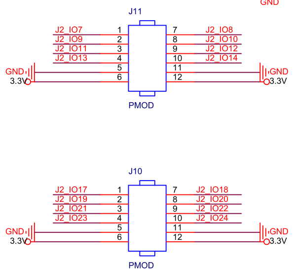

| PMOD Pin | DB_FPGA Signal | Pin | EP4CGX150 | XC7A100T | Conflicts with |
|:--------:|:--------------:|:---:|:---------:|:--------:|----------------|
| 1 | J2_IO17 | J2:15 | AF20 | J26 | — |
| 2 | J2_IO19 | J2:17 | AE19 | G21 | — |
| 3 | J2_IO21 | J2:19 | AC19 | H22 | — |
| 4 | J2_IO23 | J2:21 | AE18 | J21 | — |
| 5 | — | GND | GND | GND | — |
| 6 | — | 3.3V | 3.3V | 3.3V | — |
| 7 | J2_IO18 | J2:16 | AF21 | J25 | — |
| 8 | J2_IO20 | J2:18 | AF19 | G20 | — |
| 9 | J2_IO22 | J2:20 | AD19 | H21 | — |
| 10 | J2_IO24 | J2:22 | AF18 | K21 | — |
| 11 | — | GND | GND | GND | — |
| 12 | — | 3.3V | 3.3V | 3.3V | — |

J10 signal pins are free of peripheral conflicts (Ethernet is on J3, not J2).

### PMOD J11 (12-pin, 2x6, on J2)

| PMOD Pin | DB_FPGA Signal | Pin | EP4CGX150 | XC7A100T | Conflicts with |
|:--------:|:--------------:|:---:|:---------:|:--------:|----------------|
| 1 | J2_IO7 | J2:5 | AF24 | D26 | — |
| 2 | J2_IO9 | J2:7 | AC21 | D25 | — |
| 3 | J2_IO11 | J2:9 | AE23 | G26 | — |
| 4 | J2_IO13 | J2:11 | AE22 | E23 | — |
| 5 | — | GND | GND | GND | — |
| 6 | — | 3.3V | 3.3V | 3.3V | — |
| 7 | J2_IO8 | J2:6 | AF25 | E26 | — |
| 8 | J2_IO10 | J2:8 | AD21 | E25 | — |
| 9 | J2_IO12 | J2:10 | AF23 | H26 | — |
| 10 | J2_IO14 | J2:12 | AF22 | F23 | — |
| 11 | — | GND | GND | GND | — |
| 12 | — | 3.3V | 3.3V | 3.3V | — |

J11 pins are free of peripheral conflicts (SD card is on J3, not J2).

### JP1 GPIO Header (18-pin, 2x9, on J2)

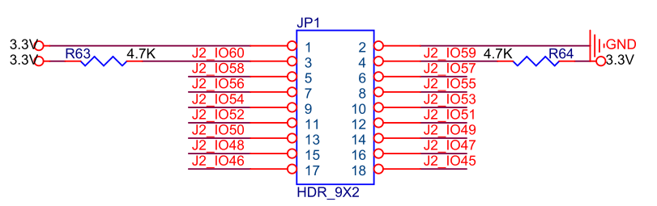

| JP1 Pin | DB_FPGA Signal | Pin | EP4CGX150 | XC7A100T |
|:-------:|:--------------:|:---:|:---------:|:--------:|
| 1 | — | 3.3V | 3.3V | 3.3V |
| 2 | — | GND | GND | GND |
| 3 | J2_IO60 | J2:58 | AD4 | AB26 |
| 4 | J2_IO59 | J2:57 | AC4 | AC26 |
| 5 | J2_IO58 | J2:56 | AE3 | W25 |
| 6 | J2_IO57 | J2:55 | AD3 | Y26 |
| 7 | J2_IO56 | J2:54 | AF5 | W21 |
| 8 | J2_IO55 | J2:53 | AF4 | Y21 |
| 9 | J2_IO54 | J2:52 | AD6 | AB24 |
| 10 | J2_IO53 | J2:51 | AD5 | AC24 |
| 11 | J2_IO52 | J2:50 | AE6 | Y25 |
| 12 | J2_IO51 | J2:49 | AE5 | AA25 |
| 13 | J2_IO50 | J2:48 | AF6 | Y22 |
| 14 | J2_IO49 | J2:47 | AE7 | Y23 |
| 15 | J2_IO48 | J2:46 | AF8 | V23 |
| 16 | J2_IO47 | J2:45 | AF7 | W23 |
| 17 | J2_IO46 | J2:44 | AF9 | U21 |
| 18 | J2_IO45 | J2:43 | AE9 | V21 |

JP1 pins 3/4 have 4.7K pull-ups. No peripheral conflicts (VGA is on J3).

## Power

- 3.3V digital (from core board via headers)
- 1.0V + 3.3V analog for Ethernet PHY
- 100 nF decoupling on power pins, 4.7 uF bulk
- 4.7 kohm pull-ups on MDIO
- 330 ohm current limiting on LEDs

## Appendix: Core Board Connector Mating

The DB_FPGA J2 and J3 connectors mate with different designators on each core board:

| DB_FPGA | EP4CGX150 | XC7A100T |
|:-------:|:---------:|:--------:|
| J2 | U5 (Banks 3, 4) | U2 (Banks 13, 14, 15) |
| J3 | U4 (Banks 5, 6, 7) | U4 (Banks 34, 35) |

The connector pinout is identical across all QMTECH core boards (pins 5-58 are
I/O signals in the same positions). Only the FPGA pin names differ per board.

Pin resolution path: Device signal -> DB_FPGA connector pin (e.g., "J3:14")
-> core board connector pin (e.g., U4 pin 14) -> FPGA pin (e.g., "PIN_A20").

## Appendix: EP4CE15 Example Projects

Complete working examples in `/srv/git/qmtech/CYCLONE_IV_EP4CE15/Software/`:

| Project | Peripheral | Description |
|---------|-----------|-------------|
| Project05_CP2102_UART_V2 | UART | Echo test, 9600 baud |
| Project06_7SEG_LED | 7-segment | 3-digit multiplexed display |
| Project07_MicroSD | SD card | SPI mode read/write |
| Project08_VGA | VGA | 1024x768@60Hz, 16-bit color, test patterns |
| Project09_GMII_Ethernet | Ethernet | GMII + UDP/IP stack |
