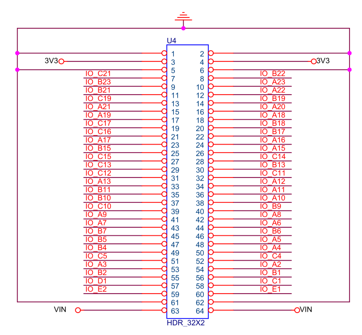
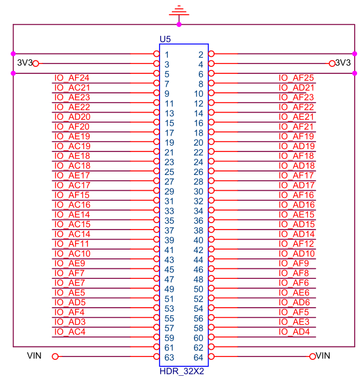

# QMTECH EP4CGX150 Core Board

## Overview

Primary JOP development platform. QMTECH EP4CGX150DF27 core board with onboard
SDR SDRAM. Connects to the [DB_FPGA daughter board](qmtech-db-fpga.md) via dual
32x2 pin headers (U4, U5) for Ethernet, UART, VGA, and SD card.
U4 mates with DB_FPGA J3, U5 mates with DB_FPGA J2.

GitHub: <https://github.com/ChinaQMTECH/EP4CGX150DF27_CORE_BOARD>

Reference files: `/srv/git/qmtech/EP4CGX150DF27_CORE_BOARD/`

Schematic: `QMTECH_EP4CGX150DF27_V2.pdf` (core board V2)

## FPGA

- **Device**: Altera Cyclone IV GX — EP4CGX150DF27I7
- **Logic Elements**: 149,760
- **Block RAM**: 6,635 Kbit (504 M9K blocks)
- **Multipliers**: 360 (18x18)
- **PLLs**: 6
- **GX Transceivers**: 4 (3.125 Gbps)
- **Package**: 672-pin FBGA (DF27)
- **Temperature**: Industrial (-40 to +100 C)
- **Speed grade**: 7
- **Core voltage**: 1.2V
- **I/O standard**: 3.3V LVCMOS (general purpose)

## Clock

- **Oscillator**: 50 MHz (PIN_B14)
- **PLL** (`dram_pll`): 50 MHz input
  - c0: 50 MHz (unused)
  - c1: 80 MHz — system clock (JOP cores, memory controller)
  - c2: 80 MHz, -3ns phase shift — SDRAM clock output
  - c3: 25 MHz — VGA pixel clock (640x480@60Hz)
- **Ethernet PLL** (`pll_125`): 50 MHz → 125 MHz for GMII TX clock

At 100 MHz (for 1-8 core configurations), the PLL is reconfigured manually
in `dram_pll.vhd`. The -3ns phase shift on c2 ensures SDRAM clock setup/hold
margins at the SDRAM chip.

## SDR SDRAM

**Component**: Winbond W9825G6JH6 — 256 Mbit (32 MB), 16-bit data bus.

| Parameter | Value |
|-----------|-------|
| Capacity | 256 Mbit (32 MB) |
| Data width | 16-bit |
| Row address | 13-bit (8192 rows) |
| Column address | 9-bit (512 columns) |
| Banks | 4 (2-bit bank address) |
| CAS latency | 3 |
| Speed grade | -6 (6ns CAS, 166 MHz max) |
| I/O standard | 3.3V LVCMOS |

**Address space**: 2^13 rows x 2^9 columns x 4 banks x 16 bits = 256 Mbit = 32 MB

**JOP SDRAM interface** (`BmbSdramCtrl32`): The JOP BMB bus is 32-bit but the
SDRAM is 16-bit. BmbSdramCtrl32 implements a 32-to-16-bit bridge that splits
each 32-bit word into two 16-bit SDRAM accesses. Burst reads (4-word BC fill,
4-element array cache fill) use SDRAM page-mode bursts for efficiency.

The SDRAM controller is an Altera-provided tri-state controller BlackBox
(`altera_sdram_tri_controller`) rather than SpinalHDL's `SdramCtrl`, which
had CKE gating issues under SMP backpressure (see `docs/sdr-sdram-gc-hang.md`).

### Pin Assignments

From `fpga/qmtech-ep4cgx150-sdram/jop_sdram.qsf`:

**SDRAM clock**: PIN_E22

**Control signals:**

| Signal | Pin |
|--------|-----|
| `sdram_CSn` | PIN_H26 |
| `sdram_CKE` | PIN_K24 |
| `sdram_WEn` | PIN_G25 |
| `sdram_RASn` | PIN_H25 |
| `sdram_CASn` | PIN_G26 |

**Bank address:**

| Signal | Pin |
|--------|-----|
| `sdram_BA[0]` | PIN_J25 |
| `sdram_BA[1]` | PIN_J26 |

**Address bus [12:0]:**

| Signal | Pin |
|--------|-----|
| `sdram_ADDR[0]` | PIN_L25 |
| `sdram_ADDR[1]` | PIN_L26 |
| `sdram_ADDR[2]` | PIN_M25 |
| `sdram_ADDR[3]` | PIN_M26 |
| `sdram_ADDR[4]` | PIN_N22 |
| `sdram_ADDR[5]` | PIN_N23 |
| `sdram_ADDR[6]` | PIN_N24 |
| `sdram_ADDR[7]` | PIN_M22 |
| `sdram_ADDR[8]` | PIN_M24 |
| `sdram_ADDR[9]` | PIN_L23 |
| `sdram_ADDR[10]` | PIN_K26 |
| `sdram_ADDR[11]` | PIN_L24 |
| `sdram_ADDR[12]` | PIN_K23 |

**Data mask:**

| Signal | Pin |
|--------|-----|
| `sdram_DQM[0]` | PIN_F26 |
| `sdram_DQM[1]` | PIN_H24 |

**Data bus [15:0]:**

| Signal | Pin |
|--------|-----|
| `sdram_DQ[0]` | PIN_B25 |
| `sdram_DQ[1]` | PIN_B26 |
| `sdram_DQ[2]` | PIN_C25 |
| `sdram_DQ[3]` | PIN_C26 |
| `sdram_DQ[4]` | PIN_D25 |
| `sdram_DQ[5]` | PIN_D26 |
| `sdram_DQ[6]` | PIN_E25 |
| `sdram_DQ[7]` | PIN_E26 |
| `sdram_DQ[8]` | PIN_H23 |
| `sdram_DQ[9]` | PIN_G24 |
| `sdram_DQ[10]` | PIN_G22 |
| `sdram_DQ[11]` | PIN_F24 |
| `sdram_DQ[12]` | PIN_F23 |
| `sdram_DQ[13]` | PIN_E24 |
| `sdram_DQ[14]` | PIN_D24 |
| `sdram_DQ[15]` | PIN_C24 |

### Other Pins

| Signal | Pin | Function |
|--------|-----|----------|
| `clk_in` | PIN_B14 | 50 MHz oscillator |
| `led[0]` | PIN_A25 | Core board LED 0 |
| `led[1]` | PIN_A24 | Core board LED 1 |

UART, Ethernet, VGA, and SD card pins are on the DB_FPGA daughter board.
See [QMTECH DB_FPGA Daughter Board](qmtech-db-fpga.md) for pin assignments.

## JOP Configuration

From `JopSdramTop.scala`:

```scala
JopCoreConfig(
  memConfig = JopMemoryConfig(burstLen = 4),  // addressWidth=25 (default, 32 MB)
  clkFreqHz = 80000000L,                      // 80 MHz (100 MHz for 1-8 cores)
  ioConfig = ioConfig                         // DB_FPGA peripherals when present
)
```

| Parameter | Value | Notes |
|-----------|-------|-------|
| `addressWidth` | 25 (default) | 23-bit physical word + 2 type bits = 32 MB |
| `mainMemSize` | 0 (auto) | Auto-derives to 32 MB from addressWidth |
| `burstLen` | 4 | 4-word SDRAM page-mode burst |
| `stackRegionWordsPerCore` | 8192 | 32 KB per-core stack region |
| System clock | 80 MHz | 100 MHz for <=8 cores |
| SDRAM clock | 80/100 MHz, -3ns phase | Matched to system clock |

### Address Flow

```
JOP pipeline → BmbMemoryController → BMB bus → BmbSdramCtrl32 → SDRAM
  25-bit word     (aoutAddr<<2).resized   27-bit byte   32→16 bridge    16-bit
  [24:23]=type                            [26:25]=00    2 accesses      W9825G6JH6
```

## SMP Scaling

The EP4CGX150 is the highest-capacity Cyclone IV GX available. SMP scaling
has been verified on hardware:

| Cores | Fmax | LEs | LE % | Timing | Status |
|:-----:|:----:|----:|:----:|--------|--------|
| 1 | 100 MHz | ~5,400 | 4% | +10 ns slack | Working |
| 2 | 100 MHz | ~11,000 | 7% | +6 ns slack | Working |
| 4 | 100 MHz | ~22,000 | 15% | +3 ns slack | Working |
| 8 | 100 MHz | ~44,000 | 29% | +1.9 ns slack | Working |
| 16 | 80 MHz | ~129,000 | 86% | +1.8 ns slack | Working |

At 16 cores the FPGA is near capacity. 8 cores at 100 MHz is the practical
sweet spot — comfortable resource headroom and no clock downgrade needed.

### Resource Budget (per core, approximate)

| Resource | Per Core | Shared Overhead |
|----------|:--------:|:---------------:|
| LEs | ~5,400 | ~3,000 (arbiter, CmpSync, SDRAM ctrl) |
| M9K blocks | ~3 | ~2 (SDRAM ctrl FIFOs) |
| Multipliers | 1 | 0 |

### SDRAM Bandwidth Under SMP

SDR SDRAM at 80-100 MHz with 16-bit bus:
- Peak bandwidth: 100 MHz x 2 bytes = 200 MB/s
- Effective (with row activation, refresh, 32→16 bridge overhead): ~100-130 MB/s

With N cores sharing the SDRAM through a round-robin arbiter:
- Per-core bandwidth depends on method cache, object cache, and array cache hit rates
- Cache hit rates are typically >90% for compute-bound JOP workloads
- Main SDRAM pressure comes from: BC fill (miss), GC handle scanning, memCopy

The 32→16-bit bridge means every 32-bit access requires 2 SDRAM cycles. Burst
reads (BC fill = 4 words = 8 SDRAM accesses) amortize row-activation overhead.

## Configuration and Boot

**JTAG programming**: USB-Blaster via JTAG header on core board.

**Flash boot**: EPCS128 serial configuration flash. The flash holds both the
FPGA bitstream and the JOP application binary:
- Offset 0x000000: FPGA bitstream (.rpd format)
- Offset 0x800000: JOP application (.jop binary)
- See `fpga/scripts/make_flash_image.py` for image creation

**Serial boot**: Default mode. FPGA loads via JTAG, then JOP application is
downloaded over UART at 2 Mbaud using `fpga/scripts/download.py`.

The download protocol streams all 32-bit words (MSB-first) without per-byte
echo, then verifies an XOR checksum:

1. Host streams all words as raw bytes in 4 KB chunks (~190 KB/s at 2 Mbaud)
2. FPGA computes running XOR checksum as each word is stored to SDRAM
3. FPGA sends 4-byte XOR checksum back (MSB-first)
4. Host verifies checksum — sends ACK (0x00) on match, NACK (0xFF) on mismatch
5. On NACK, FPGA resets and host retries (up to 3 attempts)
6. On ACK, FPGA boots the downloaded application

## FPGA Build

All build files are in `fpga/qmtech-ep4cgx150-sdram/`.

| Target | Command | Description |
|--------|---------|-------------|
| Single-core | `make full` | microcode + generate + build + program + download |
| SMP (2-core default) | `make full-smp` | SMP microcode + generate + build + program + download |
| DB_FPGA | `make full-dbfpga` | With Ethernet + VGA + SD card |
| Flash boot | `make full-flash-boot` | Build for autonomous flash boot |
| Flash program | `make program-flash` | Write bitstream + .jop to flash |

Timing constraints: `jop_sdram.sdc` — 50 MHz input, PLL-derived clocks,
asynchronous clock groups for Ethernet PLL and PHY RX clock.

## SignalTap Debug

The QSF includes a 96-signal SignalTap II configuration (commented out by
default). Signals include memory controller state, BMB bus handshake, SDRAM
bus, microcode PC, and Java bytecode PC. Useful for debugging SDRAM timing
issues and pipeline stalls. Enable by uncommenting the SignalTap section in
`jop_sdram.qsf`.

## U4/U5 Connector Mapping

The U4 and U5 headers are 32x2 pin (64 pins each) at 0.1" pitch. These
connect the core board to daughter boards (e.g. DB_FPGA). U4 mates with
DB_FPGA J3, U5 mates with DB_FPGA J2.

From core board schematic `QMTECH-EP4CGX150GX-CORE-BOARD-V01`.

**U4** (Banks 5, 6, 7 -- mates with DB_FPGA J3):



Carries ETH, VGA, SD card signals when DB_FPGA is attached.

| Pin | FPGA | Pin | FPGA | Pin | FPGA | Pin | FPGA |
|:---:|:----:|:---:|:----:|:---:|:----:|:---:|:----:|
| 1 | GND | 2 | GND | 3 | 3V3 | 4 | 3V3 |
| 5 | C21 | 6 | B22 | 7 | B23 | 8 | A23 |
| 9 | B21 | 10 | A22 | 11 | C19 | 12 | B19 |
| 13 | A21 | 14 | A20 | 15 | A19 | 16 | A18 |
| 17 | C17 | 18 | B18 | 19 | C16 | 20 | B17 |
| 21 | A17 | 22 | A16 | 23 | B15 | 24 | A15 |
| 25 | C15 | 26 | C14 | 27 | C13 | 28 | B13 |
| 29 | C12 | 30 | C11 | 31 | A13 | 32 | A12 |
| 33 | B11 | 34 | A11 | 35 | B10 | 36 | A10 |
| 37 | C10 | 38 | B9 | 39 | A9 | 40 | A8 |
| 41 | A7 | 42 | A6 | 43 | B7 | 44 | B6 |
| 45 | B5 | 46 | A5 | 47 | B4 | 48 | A4 |
| 49 | C5 | 50 | C4 | 51 | A3 | 52 | A2 |
| 53 | B2 | 54 | B1 | 55 | D1 | 56 | C1 |
| 57 | E2 | 58 | E1 | | | | |

**U5** (Banks 3, 4 -- mates with DB_FPGA J2):



Carries CP2102N UART, 7-segment display, LEDs, PMODs J10/J11, JP1 signals
when DB_FPGA is attached.

| Pin | FPGA | Pin | FPGA | Pin | FPGA | Pin | FPGA |
|:---:|:----:|:---:|:----:|:---:|:----:|:---:|:----:|
| 1 | GND | 2 | GND | 3 | 3V3 | 4 | 3V3 |
| 5 | AF24 | 6 | AF25 | 7 | AC21 | 8 | AD21 |
| 9 | AE23 | 10 | AF23 | 11 | AE22 | 12 | AF22 |
| 13 | AD20 | 14 | AE21 | 15 | AF20 | 16 | AF21 |
| 17 | AE19 | 18 | AF19 | 19 | AC19 | 20 | AD19 |
| 21 | AE18 | 22 | AF18 | 23 | AC18 | 24 | AD18 |
| 25 | AE17 | 26 | AF17 | 27 | AC17 | 28 | AD17 |
| 29 | AF15 | 30 | AF16 | 31 | AC16 | 32 | AD16 |
| 33 | AE14 | 34 | AE15 | 35 | AC15 | 36 | AD15 |
| 37 | AC14 | 38 | AD14 | 39 | AF11 | 40 | AF12 |
| 41 | AC10 | 42 | AD10 | 43 | AE9 | 44 | AF9 |
| 45 | AF7 | 46 | AF8 | 47 | AE7 | 48 | AF6 |
| 49 | AE5 | 50 | AE6 | 51 | AD5 | 52 | AD6 |
| 53 | AF4 | 54 | AF5 | 55 | AD3 | 56 | AE3 |
| 57 | AC4 | 58 | AD4 | | | | |

27 I/O pairs per header (54 I/O pins each, 108 total). Pin 1-2 = GND,
pin 3-4 = 3V3, pin 5-58 = I/O signals, 59-62 = NC,
pin 63-64 = VIN.

### DB_FPGA Peripheral to Connector Cross-Reference

The DB_FPGA daughter board's peripherals map to these connector pins.
Connector names are DB_FPGA designators: J2 resolves through U5 (Banks 3,4),
J3 resolves through U4 (Banks 5,6,7). Pin numbers are physical connector
pin numbers matching Board.scala.

| Function | Connector | Pins | FPGA Pins |
|----------|:---------:|------|-----------|
| UART TX | J2 | 13 | AD20 |
| UART RX | J2 | 14 | AE21 |
| SD CLK | J3 | 9 | B21 |
| SD CMD | J3 | 10 | A22 |
| SD DAT0 | J3 | 8 | A23 |
| SD DAT1 | J3 | 7 | B23 |
| SD DAT2 | J3 | 12 | B19 |
| SD DAT3/CS | J3 | 11 | C19 |
| SD CD | J3 | 6 | B22 |
| ETH MDC | J3 | 14 | A20 |
| ETH MDIO | J3 | 13 | A21 |
| ETH RESET | J3 | 24 | A15 |
| ETH RXC | J3 | 35 | B10 |
| ETH RXDV | J3 | 40 | A8 |
| ETH RXD[0:7] | J3 | 39-31 | A9,B9,C10,A10,A11,B11,A12,A13 |
| ETH RXER | J3 | 30 | C11 |
| ETH GTXC | J3 | 27 | C13 |
| ETH TXEN | J3 | 26 | C14 |
| ETH TXER | J3 | 15 | A19 |
| ETH TXD[0:7] | J3 | 25-16 | C15,B15,A16,A17,C16,B18,C17,A18 |
| VGA HS | J3 | 42 | A6 |
| VGA VS | J3 | 41 | A7 |
| VGA R[4:0] | J3 | 58,56,57,54,55 | E1,C1,E2,B1,D1 |
| VGA G[5:0] | J3 | 53,52,50,51,48,49 | B2,A2,C4,A3,A4,C5 |
| VGA B[4:0] | J3 | 47,45,46,43,44 | B4,B5,A5,B7,B6 |
| 7-Seg data | J2 | 29,24,26,30,32,27,23,28 | AF15,AD18,AF17,AF16,AD16,AC17,AC18,AD17 |
| 7-Seg scan | J2 | 33,25,31 | AE14,AE17,AC16 |
| LEDs [2:6] | J2 | 38,37,36,35,34 | AD14,AC14,AD15,AC15,AE15 |
| DIP SW [2:6] | J3,J2 | J3:5, J2:42,41,40,39 | C21,AD10,AC10,AF12,AF11 |
| PMOD J10 | J2 | 15,17,19,21,16,18,20,22 | AF20,AE19,AC19,AE18,AF21,AF19,AD19,AF18 |
| PMOD J11 | J2 | 5,7,9,11,6,8,10,12 | AF24,AC21,AE23,AE22,AF25,AD21,AF23,AF22 |
| JP1 GPIO | J2 | 43,44,45,46,47,48,49,50,51,52,53,54,55,56,57,58 | AE9,AF9,AF7,AF8,AE7,AF6,AE5,AE6,AD5,AD6,AF4,AF5,AD3,AE3,AC4,AD4 |

## Daughter Boards

The EP4CGX150 core board connects to daughter boards via the U4/U5 headers
described above.

**DB_FPGA**: See [QMTECH DB_FPGA Daughter Board](qmtech-db-fpga.md) for
peripheral details and pin assignments.

## Comparison with Other JOP Platforms

| Feature | EP4CGX150 (SDRAM) | EP4CE115 (DDR2) | XC7A35T (DDR3) |
|---------|:-----------------:|:---------------:|:--------------:|
| LEs / LUTs | 149,760 | 114,480 | 20,800 |
| Block RAM | 6,635 Kbit | 3,888 Kbit | 1,800 Kbit |
| Memory type | SDR SDRAM | DDR2 SODIMM | DDR3 |
| Memory size | 32 MB | 1 GB | 256 MB |
| Memory bus | 16-bit | 64-bit | 16-bit |
| Peak BW | 200 MB/s | 5.3 GB/s | 3.2 GB/s |
| Max JOP cores | 16 (verified) | ~12 (estimated) | 2-3 (estimated) |
| JOP Fmax | 80-100 MHz | TBD | 100 MHz |
| Status | Primary platform | Future | GC working |

The EP4CGX150's advantage is logic capacity (16-core SMP verified). The EP4CE115
and XC7A35T have far more memory bandwidth but fewer logic resources. The ideal
large-scale JOP platform would be an EP4CE115-class FPGA (or larger) with DDR2/DDR3
and the DB_FPGA daughter board for I/O.

## Reference Projects (QMTECH)

In `/srv/git/qmtech/EP4CGX150DF27_CORE_BOARD/`:

| Project | Description |
|---------|-------------|
| Project01_Test_Led | LED blink test |
| Project04_SDRAM | SDRAM read/write test |

For DB_FPGA peripheral examples (Ethernet, UART, VGA, SD card, 7-segment),
see the EP4CE15 examples in `/srv/git/qmtech/CYCLONE_IV_EP4CE15/Software/`
which use the same daughter board with different pin assignments.
