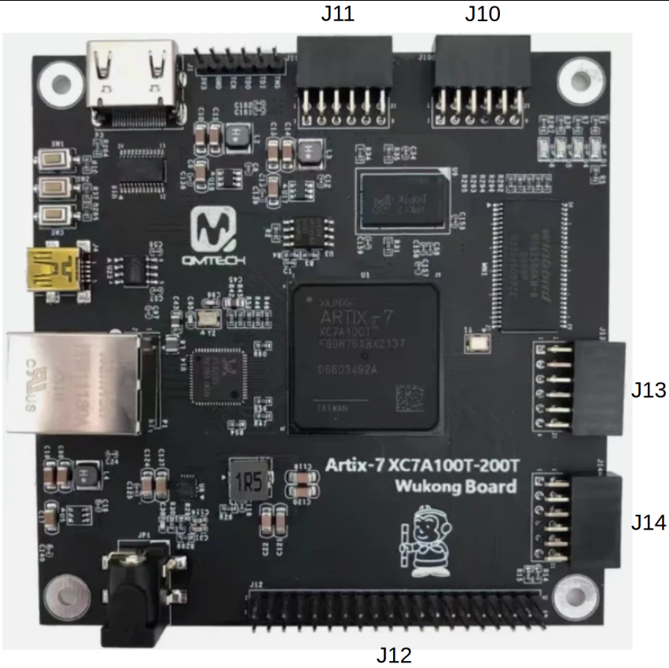

# QMTECH XC7A100T Wukong Board V3

## Overview

Self-contained Artix-7 development board with DDR3, SDR SDRAM, Gigabit Ethernet,
HDMI, USB UART, and SD card all built-in. **Does not require the DB_FPGA daughter
board** — all peripherals are on the main PCB.

GitHub: <https://github.com/ChinaQMTECH/QM_XC7A100T_WUKONG_BOARD>

Reference files: `/srv/git/qmtech/QM_XC7A100T_WUKONG_BOARD/V3/`

Schematic: [QMTECH-XC7A100T_200T-Wukong-Board-V03-20240121.pdf](https://github.com/ChinaQMTECH/QM_XC7A100T_WUKONG_BOARD/blob/main/V3/Hardware/QMTECH-XC7A100T_200T-Wukong-Board-V03-20240121.pdf)
(local: `V3/Hardware/QMTECH-XC7A100T_200T-Wukong-Board-V03-20240121.pdf`)

## FPGA

- **Device**: Xilinx Artix-7 — XC7A100T-FGG676
- **Logic Cells**: 101,440
- **LUTs**: 63,400
- **Block RAM**: 4,860 Kbit
- **DSP slices**: 240
- **Package**: FGG676 (676-pin BGA)
- **Speed grade**: -2
- **GTP Transceivers**: 8 (6.6 Gbps)

## Clock

- **Oscillator**: 50 MHz, SG-8002JC (PIN M21, LVCMOS33)
- DDR3 MIG generates 333 MHz DDR3 clock from 50 MHz reference
- JOP system clock: separate PLL from 50 MHz input

## Peripherals

All peripherals are built into the main board:

| Peripheral | Component | Interface | Notes |
|------------|-----------|-----------|-------|
| **DDR3** | MT41K128M16JT-125 | DDR3L x16, 256 MB | Primary memory (1.35V SSTL135) |
| **SDR SDRAM** | W9825G6KH-6 | SDR x16, 32 MB | Secondary memory (3.3V LVCMOS) |
| **Ethernet** | RTL8211EG PHY | GMII (1 Gbps) | 25 MHz PHY reference crystal |
| **HDMI** | TPD12S016 buffer | DVI-D output | With DDC I2C + CEC |
| **UART** | CH340N USB-to-UART | TX/RX + USB mini-B | |
| **SD card** | microSD slot | 4-bit / SPI | With card detect |
| **Flash** | N25Q064A | Quad-SPI, 64 Mbit (8 MB) | FPGA configuration flash |
| **GPIO** | 2 LEDs, 2 buttons | LVCMOS33 | |
| **PMOD** | J10, J11, J13, J14 | 12-pin GPIO each | General purpose expansion |

## DDR3 SDRAM

**Component**: Micron MT41K128M16JT-125 — DDR3L, 2 Gbit (256 MB), 16-bit.

Same DDR3 chip as the Alchitry Au V2 and the QMTECH XC7A100T Core Board.
The existing JOP DDR3 subsystem should work with MIG regeneration and pin
reassignment.

| Parameter | Value |
|-----------|-------|
| Capacity | 2 Gbit (256 MB) |
| Data width | 16-bit |
| Address | 14-bit row, 10-bit column, 3-bit bank |
| Speed | DDR3L-1333 (667 MHz data rate) |
| Voltage | 1.35V |
| I/O standard | SSTL135 |

### The system clock IS the MIG user clock — read this before changing core count

There is **no free-running system PLL on the DDR3 path**. `Board.scala`'s
`SDRAM_DDR3` case returns no `systemClk` at all — only `migSysClk`, `migRefClk`
and `ethClk` — and `JopTop.scala` clocks the entire JOP cluster from
`ddr3Mig.io.ui_clk`. With `PHYRatio 4:1`:

```
clk_wiz CLKOUT1  ->  MIG sys_clk  ->  memory clock  ->  ui_clk = memory / 4
```

Stock is `TimePeriod 2500` ps → 400 MHz memory → **ui_clk 100 MHz**. So the core
clock is quantised to (memory clock)/4 and cannot be dialled like an Altera PLL:
lowering it to fit more cores means regenerating the MIG IP.

**It is three coupled edits, not one.** MIG dictates its own sys_clk input for a
given memory period, and will *silently retune* it if you change only the period:

```
CRITICAL WARNING: [Mig7series 79-144] Invalid Input Clock Period 100.0.
Setting to nearest possible Input Clock Period value 97.787.
```

Left unnoticed, that gives a memory clock a few percent off target and a ui_clk
to match — with everything still building cleanly.

#### Recipe: 6 cores at ui_clk 91.65 MHz (validated 2026-08-16)

**Steps 1 and 2 are obsolete — do not hand-edit those files.** Both values now
come from the preset's `MigProfile`: `JopTopVerilog` calls `MigProfile.emit`,
which writes a generated `mig.prj` and a `ddr3_clocks.tcl` carrying the header
*"GENERATED FROM THE PRESET's MigProfile — DO NOT EDIT"*, and
`create_ddr3_clk_wiz.tcl` sources that fragment so it overrides the literal in
the script. The tracked `vivado/ip/mig.prj` is the template INPUT, not the knob.
Kept here as the record of what the numbers were and why:

1. ~~`vivado/ip/mig.prj` — `TimePeriod` 2500 → **2727**, `InputClkFreq` 100.0 →
   **97.787**.~~ Now from `MigProfile`.
2. ~~`vivado/tcl/create_ddr3_clk_wiz.tcl` — `CLKOUT1_REQUESTED_OUT_FREQ`
   100.000 → **97.787**.~~ Achieved 97.764 (50 × 60.125/3 / 10.25), 0.02 % low.
   Now from the generated `ddr3_clocks.tcl`.
3. `make ddr3-create-ip` — runs both scripts.
4. Generate with the matching ui_clk **in Hz**:
   `sbt "runMain jop.system.JopTopVerilog wukongDdr3Smp 6 91650000"`.
   NOTE: `make ddr3-smp-build` in step 5 builds `wukongSmp $(DDR3_SMP_CORES)`,
   a DIFFERENT preset in a different `build/<config>/` directory. To build what
   step 4 generated, pass it through:
   `make ddr3-smp-bitstream CFG="wukongDdr3Smp 6 91650000"`.
   See `docs/measurement-presets.md` — `wukongDdr3Smp` is a measurement vehicle
   that no board target selects.
   91.65 MHz is not an integer MHz, hence Hz. This sets the microsecond
   prescaler and the UART divider; get it wrong and the board goes quiet.
5. `make ddr3-smp-build`, program, and **download at 2000000 baud**
   (2037000 for bitstreams built before 2026-08-18) —
   the old `UartCtrl` divided `clkFreq / (baud × 5)`, so 91.65 MHz yielded
   2.0367 Mbaud; `UartBaudTick` now makes it exact,
   not 2.

Result: 68.4 % LUT, post-route WNS +0.018 / WHS +0.059; `SMPGC OK` 4/4 runs and
DoAll 66/66, both generational.

**Why this is not checked in.** Eleven presets declare `clkFreq = 100 MHz` and
share this MIG, so committing 2727 would silently drop all of them to 91.65 MHz
with a wrong UART divider. `mig.prj` and the clk_wiz script stay at 2500 / 100.0
and the edit is deliberate — the same convention `dram_pll.vhd` uses on the
EP4CGX150. `JopTopVerilog` cross-checks the two against the preset at generation
time and refuses to proceed on a mismatch, so a forgotten step is caught before
a build rather than after a silent board.

#### Known-good points

| TimePeriod | MIG sys_clk in | memory | ui_clk | status |
|---|---|---|---|---|
| 2500 ps | 100.0 MHz | 400 MHz | 100 MHz | stock; 4 cores |
| 2727 ps | 97.787 MHz | 366.6 MHz | 91.65 MHz | **validated, 6 cores** |
| 2778 ps | 102.848 MHz | 360 MHz | 90 MHz | rejected — MIG will not take a 100 MHz input, and 102.848 is not what the clk_wiz feeds it |

2778 was tried first because a 90 MHz ui_clk would give an exact 2 Mbaud. It is
not reachable from this board's clk_wiz. The awkward 2.0367 Mbaud that used
to imply is gone -- the UART no longer divides by an integer.

### DDR3 Pin Assignments

From `DDR3.ucf`:

| Signal | Pins |
|--------|------|
| `ddr3_addr[13:0]` | E17, G17, F17, C17, G16, D16, H16, E16, H14, F15, F20, H15, C18, G15 |
| `ddr3_ba[2:0]` | B17, D18, A17 |
| `ddr3_ras_n` | A19 |
| `ddr3_cas_n` | B19 |
| `ddr3_we_n` | A18 |
| `ddr3_cke` | E18 |
| `ddr3_odt` | G19 |
| `ddr3_reset_n` | H17 |
| `ddr3_ck_p / ck_n` | F18 / F19 |
| `ddr3_dq[0]` | D21 |
| `ddr3_dq[1]` | C21 |
| `ddr3_dq[2]` | B22 |
| `ddr3_dq[3]` | B21 |
| `ddr3_dq[4]` | D19 |
| `ddr3_dq[5]` | E20 |
| `ddr3_dq[6]` | C19 |
| `ddr3_dq[7]` | D20 |
| `ddr3_dq[8]` | C23 |
| `ddr3_dq[9]` | D23 |
| `ddr3_dq[10]` | B24 |
| `ddr3_dq[11]` | B25 |
| `ddr3_dq[12]` | C24 |
| `ddr3_dq[13]` | C26 |
| `ddr3_dq[14]` | A25 |
| `ddr3_dq[15]` | B26 |
| `ddr3_dqs_p[1:0]` | B20, A23 |
| `ddr3_dqs_n[1:0]` | A20, A24 |
| `ddr3_dm[1:0]` | A22, C22 |

## SDR SDRAM

**Component**: Winbond W9825G6KH-6 — 256 Mbit (32 MB), 16-bit data bus.

Same chip family as the QMTECH EP4CGX150 core board's W9825G6JH6. The existing
JOP SDRAM path (BmbSdramCtrl32 with 32→16 bridge) would work here, though on
Xilinx the Altera tri-state controller BlackBox would need to be replaced with
SpinalHDL's SdramCtrl (or an equivalent Xilinx controller).

| Parameter | Value |
|-----------|-------|
| Capacity | 256 Mbit (32 MB) |
| Data width | 16-bit |
| Row address | 13-bit |
| Column address | 9-bit |
| Banks | 4 (2-bit) |
| CAS latency | 2 or 3 |
| Max frequency | 166 MHz |
| I/O standard | 3.3V LVCMOS |

### SDR SDRAM Pin Assignments

From `Test10_SDRAM` project XDC:

**Control signals:**

| Signal | Pin |
|--------|-----|
| `SDCLK0` | G22 |
| `SDCKE0` | H22 |
| `SDCS0` | L25 |
| `RAS` | K26 |
| `CAS` | K25 |
| `SDWE` | J26 |

**Bank address [1:0]:**

| Signal | Pin |
|--------|-----|
| `Bank[0]` | M25 |
| `Bank[1]` | M26 |

**Data mask [1:0]:**

| Signal | Pin |
|--------|-----|
| `DQM[0]` | J25 |
| `DQM[1]` | K23 |

**Address bus [12:0]:**

| Signal | Pin |
|--------|-----|
| `Address[0]` | R26 |
| `Address[1]` | P25 |
| `Address[2]` | P26 |
| `Address[3]` | N26 |
| `Address[4]` | M24 |
| `Address[5]` | M22 |
| `Address[6]` | L24 |
| `Address[7]` | L23 |
| `Address[8]` | L22 |
| `Address[9]` | K21 |
| `Address[10]` | R25 |
| `Address[11]` | K22 |
| `Address[12]` | J21 |

**Data bus [15:0]:**

| Signal | Pin |
|--------|-----|
| `Data[0]` | D25 |
| `Data[1]` | D26 |
| `Data[2]` | E25 |
| `Data[3]` | E26 |
| `Data[4]` | F25 |
| `Data[5]` | G25 |
| `Data[6]` | G26 |
| `Data[7]` | H26 |
| `Data[8]` | J24 |
| `Data[9]` | J23 |
| `Data[10]` | H24 |
| `Data[11]` | H23 |
| `Data[12]` | G24 |
| `Data[13]` | F24 |
| `Data[14]` | F23 |
| `Data[15]` | E23 |

## System Pins

| Signal | Pin | I/O Standard | Bank | Function |
|--------|-----|-------------|------|----------|
| `SYS_CLK` | M21 | LVCMOS33 | 14 | 50 MHz oscillator (Y1) |
| `SYS_RST_N` | H7 | LVCMOS33 | 35 | Reset button KEY0/SW2 (active low) |
| `LED0` | G21 | LVCMOS33 | 15 | User LED 0 (D5) |
| `LED1` | G20 | LVCMOS33 | 15 | User LED 1 (D6) |
| `KEY1` | M6 | LVCMOS33 | 34 | Push button (SW3) |

## UART (CH340N USB-to-UART)

| Signal | Pin | Direction |
|--------|-----|-----------|
| `UART_TX` | E3 | FPGA → CH340N |
| `UART_RX` | F3 | CH340N → FPGA |

USB connector: J4 (Mini USB Type-B).

## Ethernet (RTL8211EG, GMII)

From `Test08_GMII_Ethernet` XDC. Same PHY as DB_FPGA.

**Transmit path:**

| Signal | Pin |
|--------|-----|
| `ETH_TXC` (GTX_CLK) | U1 |
| `ETH_TX_EN` | T2 |
| `ETH_TX_ER` | J1 |
| `ETH_TXD[0]` | R2 |
| `ETH_TXD[1]` | P1 |
| `ETH_TXD[2]` | N2 |
| `ETH_TXD[3]` | N1 |
| `ETH_TXD[4]` | M1 |
| `ETH_TXD[5]` | L2 |
| `ETH_TXD[6]` | K2 |
| `ETH_TXD[7]` | K1 |

**Receive path:**

| Signal | Pin |
|--------|-----|
| `ETH_RXC` | P4 |
| `ETH_RX_DV` | L3 |
| `ETH_RX_ER` | U5 |
| `ETH_RXD[0]` | M4 |
| `ETH_RXD[1]` | N3 |
| `ETH_RXD[2]` | N4 |
| `ETH_RXD[3]` | P3 |
| `ETH_RXD[4]` | R3 |
| `ETH_RXD[5]` | T3 |
| `ETH_RXD[6]` | T4 |
| `ETH_RXD[7]` | T5 |

**Management and status:**

| Signal | Pin |
|--------|-----|
| `ETH_MDC` | H2 |
| `ETH_MDIO` | H1 |
| `ETH_RESET_N` | R1 |
| `ETH_COL` | U4 |
| `ETH_CRS` | U2 |

All Ethernet signals are Bank 34, LVCMOS33.
25 MHz PHY reference crystal (Y2) is on-board, independent of 50 MHz system clock.

## HDMI Output (DVI-D via TPD12S016)

From `Test06_HDMI_OUT` XDC.

**TMDS differential pairs:**

| Signal | Pin | I/O Standard |
|--------|-----|-------------|
| `HDMI_D0_P` | E1 | TMDS_33 |
| `HDMI_D0_N` | D1 | TMDS_33 |
| `HDMI_D1_P` | F2 | TMDS_33 |
| `HDMI_D1_N` | E2 | TMDS_33 |
| `HDMI_D2_P` | G2 | TMDS_33 |
| `HDMI_D2_N` | G1 | TMDS_33 |
| `HDMI_CLK_P` | D4 | TMDS_33 |
| `HDMI_CLK_N` | C4 | TMDS_33 |

**Control signals (via TPD12S016 level shifter):**

| Signal | Pin | I/O Standard | Function |
|--------|-----|-------------|----------|
| `HDMI_SCL` | B2 | LVCMOS33 | I2C clock (DDC, 4.7K pullup) |
| `HDMI_SDA` | A2 | LVCMOS33 | I2C data (DDC, 4.7K pullup) |
| `HDMI_HPD` | A3 | LVCMOS33 | Hot Plug Detect |
| `HDMI_CEC` | B1 | LVCMOS33 | Consumer Electronics Control |

## SD Card (microSD, J9)

| Signal | Pin | Bank | Function |
|--------|-----|------|----------|
| `SD_CLK` | L4 | 34 | Clock |
| `SD_CMD` | J8 | 35 | Command / MOSI |
| `SD_DAT0` | M5 | 34 | Data 0 / MISO |
| `SD_DAT1` | M7 | 34 | Data 1 |
| `SD_DAT2` | H6 | 35 | Data 2 |
| `SD_DAT3` | J6 | 35 | Data 3 / CS |
| `SD_CD` | N6 | 34 | Card detect |

## Configuration Flash (N25Q064A, Quad-SPI)

Uses dedicated FPGA configuration pins in Bank 14.

| Signal | Pin | Bank | Function |
|--------|-----|------|----------|
| `FLASH_CS_N` | P18 | 14 | Chip select (FCS_B, active low) |
| `FLASH_DQ0` | R14 | 14 | IO[0] / SO |
| `FLASH_DQ1` | R15 | 14 | IO[1] / SI (MOSI) |
| `FLASH_DQ2` | P14 | 14 | IO[2] / WP |
| `FLASH_DQ3` | N14 | 14 | IO[3] / HOLD |
| `FLASH_CLK` | H13 | — | CCLK (dedicated, use STARTUPE2) |

Bitstream config: SPIx4, 50 MHz, CFGBVS=VCCO, CONFIG_VOLTAGE=3.3V.
Post-configuration flash access requires STARTUPE2 primitive for CCLK.

## PMOD Connectors



Standard 12-pin PMOD (8 I/O + 2 GND + 2 VCC).

**J10 (Bank 35, LVCMOS33):**

| Pin | FPGA Pin | Pin | FPGA Pin |
|:---:|----------|:---:|----------|
| 1 | D5 | 7 | E5 |
| 2 | G5 | 8 | E6 |
| 3 | G7 | 9 | D6 |
| 4 | G8 | 10 | G6 |
| 5 | GND | 11 | GND |
| 6 | VCC 3.3V | 12 | VCC 3.3V |

**J11 (Bank 35, LVCMOS33):**

| Pin | FPGA Pin | Pin | FPGA Pin |
|:---:|----------|:---:|----------|
| 1 | H4 | 7 | J4 |
| 2 | F4 | 8 | G4 |
| 3 | A4 | 9 | B4 |
| 4 | A5 | 10 | B5 |
| 5 | GND | 11 | GND |
| 6 | VCC 3.3V | 12 | VCC 3.3V |

**J13 (Bank 14, LVCMOS33):**

| Pin | FPGA Pin | Pin | FPGA Pin |
|:---:|----------|:---:|----------|
| 1 | N22 | 7 | P20 |
| 2 | N21 | 8 | N23 |
| 3 | R20 | 9 | P21 |
| 4 | T22 | 10 | R21 |
| 5 | GND | 11 | GND |
| 6 | VCC 3.3V | 12 | VCC 3.3V |

**J14 (Bank 14, LVCMOS33):**

| Pin | FPGA Pin | Pin | FPGA Pin |
|:---:|----------|:---:|----------|
| 1 | P23 | 7 | N24 |
| 2 | R23 | 8 | P24 |
| 3 | T24 | 9 | R22 |
| 4 | T25 | 10 | T23 |
| 5 | GND | 11 | GND |
| 6 | VCC 3.3V | 12 | VCC 3.3V |

All PMOD pins are on dedicated I/O — no sharing conflicts with other
on-board peripherals.

## J12 Breakout Header (Bank 13, LVCMOS33)

40-pin (20x2) header. Full Bank 13 I/O breakout.

| Pin | FPGA Pin | Pin | FPGA Pin |
|:---:|----------|:---:|----------|
| 1 | GND | 2 | VIN (5V) |
| 3 | U14 | 4 | V14 |
| 5 | U15 | 6 | U16 |
| 7 | V16 | 8 | V17 |
| 9 | V18 | 10 | W18 |
| 11 | V19 | 12 | W19 |
| 13 | T20 | 14 | U20 |
| 15 | W21 | 16 | Y21 |
| 17 | U22 | 18 | V22 |
| 19 | V23 | 20 | W23 |
| 21 | AB24 | 22 | AC24 |
| 23 | AA24 | 24 | AB25 |
| 25 | V24 | 26 | W24 |
| 27 | AB26 | 28 | AC26 |
| 29 | Y25 | 30 | AA25 |
| 31 | W25 | 32 | Y26 |
| 33 | V26 | 34 | W26 |
| 35 | U25 | 36 | U26 |
| 37 | GND | 38 | GND |
| 39 | VCCO_13 (3.3V) | 40 | VCCO_13 (3.3V) |

## FPGA I/O Banks

| Bank | Voltage | Primary Function |
|------|---------|------------------|
| 13 | 3.3V | J12 breakout header (16 I/O pairs) |
| 14 | 3.3V | SYS_CLK + SDR SDRAM (address, partial control) + config flash + PMOD J13/J14 |
| 15 | 3.3V | LEDs + SDR SDRAM (data, partial control) |
| 16 | 1.35V | DDR3 (all: address, data, control, DQS, DM, clock) |
| 34 | 3.3V | Ethernet + SD card (CLK/DAT0/DAT1/CD) + KEY1 |
| 35 | 3.3V | HDMI + UART + PMOD J10/J11 + SD card (CMD/DAT2/DAT3) + reset |

## JOP Implementation Status

All Wukong tops are generated by `JopTop(config)` via `JopTopVerilog` presets.
Entity names are backward-compatible with existing Vivado projects.

### JopDdr3WukongTop — DDR3 Full Featured (wukongFull)

JOP running on DDR3 via MIG at **100 MHz** with all four compute units
(ICU + FCU + LCU + DCU) and DSP imul. Ethernet (GMII) and SD Native enabled.
JVM test suite: **59/59 DoAll.jop on hardware**.

- **Preset**: `JopConfig.wukongFull`
- **Generate**: `sbt "runMain jop.system.JopTopVerilog wukongFull"`
- **Clock**: Board 50 MHz → ClkWiz → 100 MHz (MIG sys) + 200 MHz (MIG ref) + 125 MHz (ETH)
- **Memory**: 256 MB DDR3 (MT41K128M16JT), 32KB write-back L2 cache
- **Compute**: IntegerComputeUnit (imul DSP + idiv + irem) + FloatComputeUnit (8 ops) + LongComputeUnit (8 ops) + DoubleComputeUnit (12 ops)
- **I/O**: UART (CH340N) + Ethernet (GMII 1Gbps) + SD Native
- **Build**: `make ddr3-generate && make ddr3-build`

### JopSdramWukongTop — SDR SDRAM (wukongSdram)

JOP running on the on-board W9825G6KH-6 at **100 MHz**. Serial-boot "Hello World!"
verified working. Uses `BmbSdramCtrl32` with `SdramCtrlNoCke` (pure SpinalHDL,
no vendor IP besides ClkWiz).

- **Preset**: `JopConfig.wukongSdram`
- **Generate**: `sbt "runMain jop.system.JopTopVerilog wukongSdram"`
- **Clock**: Board 50 MHz → ClkWiz → 100 MHz system + 100 MHz -108° SDRAM clock
- **Memory**: 32 MB SDR SDRAM, CAS=3, direct BMB (no cache)
- **Features**: Hang detector, DiagUart mux, heartbeat LED (board clock domain)
- **Timing**: WNS = -0.141 ns (6 failing paths) — marginal at 100 MHz
- **Build**: `make jop-sdram-generate && make jop-sdram-build`

### JopDdr3WukongTop — DDR3 Basic (wukongDdr3)

JOP on DDR3 without compute units or extra peripherals. Same DDR3 subsystem as
Alchitry Au V2 (LruCacheCore + CacheToMigAdapter) with `WukongMigBlackBox`
(no `ddr3_cs_n` pin — Wukong MIG disables CS).

- **Preset**: `JopConfig.wukongDdr3`
- **Generate**: `sbt "runMain jop.system.JopTopVerilog wukongDdr3"`
- **Clock**: Board 50 MHz → ClkWiz → 100 MHz (MIG sys) + 200 MHz (MIG ref)
- **Memory**: 256 MB DDR3 (MT41K128M16JT), 32KB write-back L2 cache
- **Features**: Same hang detector / DiagUart mux as SDRAM top
- **Build**: `make ddr3-generate && make ddr3-build`

### JopDualWukongTop — Dual-Cluster (wukongDualIndependent / wukongDualSmp)

Two independent JOP clusters in a single bitstream, each with its own memory
controller, clock domain, and UART. Cluster 0 runs on DDR3 with all compute
units; Cluster 1 runs on SDR SDRAM with integer-only cores.

- **Presets**: `JopConfig.wukongDualIndependent` (1+1 cores), `JopConfig.wukongDualSmp(n)` (N+N cores)
- **Generate**: `sbt "runMain jop.system.JopTopVerilog wukongDualIndependent"` or `sbt "runMain jop.system.JopTopVerilog wukongDualSmp 2"`
- **Entity name**: `JopDualWukongTop`

**Cluster 0 (DDR3)**:
- Clock: 100 MHz from MIG `ui_clk`
- Memory: 256 MB DDR3 (MT41K128M16JT), 32KB write-back L2 cache
- Compute: ICU + FCU + LCU + DCU + DSP imul
- UART: CH340N USB bridge (E3/F3)

**Cluster 1 (SDR SDRAM)**:
- Clock: 80 MHz from `clk_wiz_1` (the IP is now `sdr_clk` and runs at 100 MHz — see dual-subsystem-design.md)
- Memory: 32 MB SDR SDRAM (W9825G6KH-6), CAS=3, direct BMB
- Compute: None (integer-only microcode)
- UART: J12 header pins (TX=U14, RX=V14)

**FPGA utilization**:

| Config | LUTs | % of XC7A100T | WNS |
|--------|:----:|:-------------:|:---:|
| 1+1 cores | 28,043 | 44.2% | +0.034 ns |
| 2+2 cores | 46,644 | 73.6% | +0.013 ns |

- **Build**: `make dual-generate && make dual-create-ip && make dual-build`

### SdramExerciserWukongTop — SDRAM Test

Standalone SDRAM exerciser (no JOP). Three tests loop continuously, reporting
pass/fail via UART at 1 Mbaud. Used to validate SDRAM hardware and timing
before bringing up JOP.

- **Source**: `spinalhdl/src/main/scala/jop/system/SdramExerciserWukongTop.scala`
- **Tests**: Sequential fill+readback, memCopy, write-then-read (thousands of loops PASS)
- **Build**: `make sdram-generate && make sdram-build`

### JopBramWukongTop — BRAM (wukongBram)

JOP with on-chip BRAM (128 KB). Board bring-up and UART verification only.

- **Preset**: `JopConfig.wukongBram`
- **Generate**: `sbt "runMain jop.system.JopTopVerilog wukongBram"`
- **Build**: `make generate && make build`

### FPGA Build Flow

All builds use Vivado non-project (in-process) flow. ClkWiz IP is shared between
the SDRAM exerciser and JOP SDRAM top (`make sdram-create-ip`).

```bash
cd fpga/qmtech-xc7a100t-wukong

# DDR3, the default. Makefile:151 sets DDR3_CFG ?= wukongDdr3, the integer-only
# config that passes DoAll 66/66 on hardware.
make ddr3-generate        # sbt "runMain jop.system.JopTopVerilog wukongDdr3"

# The full-featured config is NOT what ddr3-generate builds — override DDR3_CFG.
# It currently fails DoAll at FloatTest; see status items 69/74.
make ddr3-generate DDR3_CFG=wukongFull
make ddr3-create-ip       # ClkWiz + MIG IP (once)
make ddr3-build           # Vivado synth + impl + bitstream
make ddr3-program         # openFPGALoader via dirtyJtag
make ddr3-monitor         # UART monitor (after serial download)

# SDR SDRAM (wukongSdram)
make jop-sdram-generate   # sbt "runMain jop.system.JopTopVerilog wukongSdram"
make sdram-create-ip      # ClkWiz IP (once)
make jop-sdram-build      # Vivado synth + impl + bitstream
make jop-sdram-program    # openFPGALoader via dirtyJtag
make jop-sdram-monitor    # UART monitor (after serial download)

# Dual-cluster (wukongDualIndependent — DDR3 + SDR, 1+1 cores)
make dual-generate        # sbt "runMain jop.system.JopTopVerilog wukongDualIndependent"
make dual-create-ip       # ClkWiz + MIG IP (once)
make dual-build           # Vivado synth + impl + bitstream
```

### Built-In Peripherals vs DB_FPGA

The Wukong board has all peripherals on-board, eliminating the DB_FPGA:

| Feature | Wukong V3 | EP4CGX150 + DB_FPGA |
|---------|:---------:|:-------------------:|
| Ethernet | RTL8211EG (same PHY) | RTL8211EG (same PHY) |
| Display | HDMI (DVI-D) | VGA (RGB 5-6-5) |
| UART | CH340N (USB mini-B) | CP2102N (USB micro-B) |
| SD card | microSD | microSD |
| VGA | No | Yes |
| 7-segment | No | Yes (3-digit) |
| PMOD | 4 connectors | 2 connectors |

The Ethernet PHY is the same (RTL8211EG, GMII), so `Eth` + `Mdio` should
work directly. The display output is HDMI instead of VGA — `VgaText` would
need an RGB-to-DVI serializer (available as Xilinx IP or open-source VHDL).

### Estimated JOP Capacity

| Config | LUTs (est.) | % of XC7A100T |
|--------|:-----------:|:-------------:|
| 1-core + DDR3 | ~4,000 | 6% |
| 4-core SMP | ~18,000 | 28% |
| 8-core SMP | ~36,000 | 57% |
| 12-core SMP | ~54,000 | 85% |

## Example Projects

In `/srv/git/qmtech/QM_XC7A100T_WUKONG_BOARD/V3/Software/XC7A100T/`:

| Project | Description |
|---------|-------------|
| Test01_led_key | LED blink + button test |
| Test04_DDR3_MIG | Xilinx MIG DDR3 controller + traffic generator |
| Test05_usb_uart_CH340N | USB UART serial test (CH340N) |
| Test06_HDMI_OUT | HDMI video output (RGB2DVI, color bar) |
| Test08_GMII_Ethernet | Gigabit Ethernet PHY test |
| Test10_SDRAM | SDR SDRAM read/write test (W9825G6KH-6) |

## Power

Multi-rail supply with buck converters:
- 5V input via USB or DC jack
- 1.0V (VCCINT), 1.8V (VCCAUX), 1.35V (DDR3), 3.3V (I/O), 1.5V (mixed)
- TPS563201 and MP8712 regulators

## Comparison with Other JOP Platforms

| Feature | Wukong V3 | XC7A100T Core | EP4CGX150 | Au V2 (XC7A35T) |
|---------|:---------:|:------------:|:---------:|:---------------:|
| LUTs / LEs | 63,400 | 63,400 | 149,760 | 20,800 |
| Block RAM | 4,860 Kbit | 4,860 Kbit | 6,635 Kbit | 1,800 Kbit |
| DDR3 | 256 MB | 256 MB | — | 256 MB |
| SDR SDRAM | 32 MB | — | 32 MB | — |
| Ethernet | Built-in | Via DB_FPGA | Via DB_FPGA | — |
| Display | HDMI | VGA (DB_FPGA) | VGA (DB_FPGA) | — |
| Self-contained | Yes | No | No | No |
| Max JOP cores | ~12 | ~12 | 16 | 2-3 |

## Two traps when benchmarking this board (2026-08-18)

**Reprogram before EVERY download.** The serial boot loader only runs out of
reset, and a previous download attempt consumes the ready handshake. The board
then goes completely silent — indistinguishable from a dead bitstream, and it
sends you looking for the wrong fault. `fpga/scripts/run_bench wukong ...` does
this for you.

**A mis-clocked build looks dead but is not.** Building with the default
`MigProfile.Ddr3_400` while the installed IP is `TimePeriod 2727` leaves the
cluster running at ui_clk 91.676 MHz with a UART divider computed for 100 MHz —
everything 9 % out. Diagnose by listening RAW across a baud sweep instead of
trusting the downloader:

    1000000 -> b'\xff\xff\xff...'   garbage
    2000000 -> b'jJ***'             mis-framed 0xAA
    1833520 -> b'\xaa*jJ*'          <- the ready byte

`1833520 = 2000000 x 91.676/100`, and that ratio names the real clock. Rebuild
with the matching profile (`... Ddr3_366`), after which the download baud is
**2000000** — or **2037000** if the bitstream predates 2026-08-18, when the
UART still divided the clock by an integer.

Worse than a dead board: `jbe.Scale`'s timebase is `IO_US_CNT`, derived from the
same wrong `clkFreq`, so a mis-clocked build reports plausible numbers that are
all 9 % wrong.

## Runtime reset (2026-08-18)

The FPGA no longer has to be reprogrammed to load a different application:

```
make ddr3-redownload JOP_FILE=<app>.jop   # reset + download, no JTAG
make ddr3-reset                           # reset only
```

The DDR3 UART runs at exactly **2 Mbaud** (`DDR3_UART_BAUD`). It used to be
2037000, because ui_clk is 91.6758 MHz and an integer divisor could not express
2 M; `jop.io.UartBaudTick` removed that. Bitstreams built before 2026-08-18
still need 2037000. The UART is the CH340 (`/dev/ttyUSB4` at
time of writing — map it by serial, never by path).

**This is a CORE-ONLY reset.** `sys_rst` stays tied to PLL lock, so the MIG
keeps its calibration; what resets is the core, L2 cache and
`CacheToMigAdapter`. Holding the reset long enough matters — the MIG keeps
answering reads issued before it, and this path matches responses by position,
so a short hold would drop a stale beat into a fresh FIFO. See
`ResetGenerator.Ddr3ResetCycles` and `CacheMigResetSim`.

The board's existing **reset button** (`resetn` into the clock wizard) is
unchanged and remains the full reset, recalibration included — the two are
complementary.

Measured: 8/8 reset-and-redownload cycles, `CardMarkTest` reporting `CARD OK`
afterwards. Vivado timing MET, WNS +0.696 ns.
