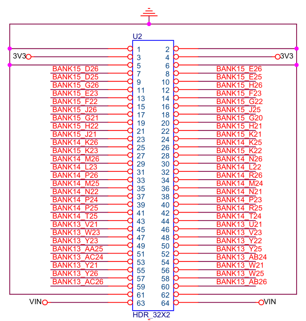
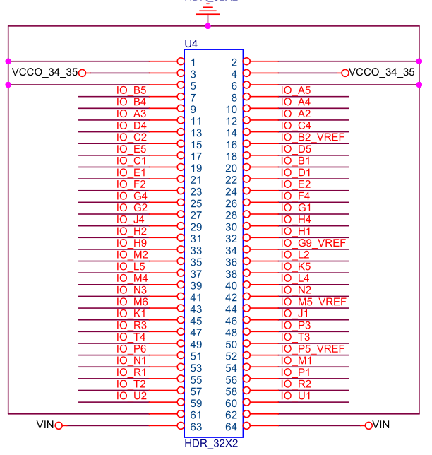

# QMTECH XC7A100T Core Board

## Overview

QMTECH Artix-7 core board with onboard DDR3 SDRAM. Connects to the
[DB_FPGA daughter board](qmtech-db-fpga.md) via dual 32x2 pin headers
(U2, U4) for Ethernet, UART, VGA, and SD card.
U2 mates with DB_FPGA J2, U4 mates with DB_FPGA J3.

GitHub: <https://github.com/ChinaQMTECH/QMTECH_XC7A75T-100T-200T_Core_Board>

Reference files: `/srv/git/qmtech/QMTECH_XC7A75T-100T-200T_Core_Board/XC7A100T/`

Schematic: [QMTECH_XC7A75T_100T_200T-CORE-BOARD-V01-20210109.pdf](https://github.com/ChinaQMTECH/QMTECH_XC7A75T-100T-200T_Core_Board/blob/main/XC7A100T/Hardware/QMTECH_XC7A75T_100T_200T-CORE-BOARD-V01-20210109.pdf)

## FPGA

- **Device**: Xilinx Artix-7 — XC7A100T-FGG676
- **Logic Cells**: 101,440
- **LUTs**: 63,400
- **Flip-flops**: 126,800
- **Block RAM**: 4,860 Kbit (135 x 36 Kbit BRAM)
- **DSP slices**: 240
- **Package**: FGG676 (676-pin BGA)
- **Speed grade**: -2
- **GTP Transceivers**: 8 (6.6 Gbps)

## Clock

- **Oscillator**: 50 MHz (PIN U22, LVCMOS33)
- DDR3 MIG generates internal clocks from 50 MHz reference (333 MHz DDR3 clock)
- JOP system clock: separate PLL from 50 MHz input (target 100 MHz)

## DDR3 SDRAM

**Component**: Micron MT41K128M16JT-125 — DDR3L, 2 Gbit (256 MB), 16-bit data bus.

| Parameter | Value |
|-----------|-------|
| Capacity | 2 Gbit (256 MB) |
| Data width | 16-bit |
| Row address | 14-bit |
| Column address | 10-bit |
| Banks | 8 (3-bit bank address) |
| Speed | DDR3L-1333 (667 MHz data rate) |
| Voltage | 1.35V (SSTL135) |
| Burst length | 8 (fixed for DDR3) |

This is the same DDR3 chip family (MT41K128M16) as the Alchitry Au V2. The
existing JOP DDR3 subsystem (MIG + BmbCacheBridge + LruCacheCore + CacheToMigAdapter)
should work with only pin reassignment and MIG regeneration for the new board.

### DDR3 Pin Assignments

From `/srv/git/qmtech/QMTECH_XC7A75T-100T-200T_Core_Board/XC7A100T/Software_XC7A100T/DDR3.ucf`:

**Address bus [13:0]:**

| Signal | Pin |
|--------|-----|
| `ddr3_addr[0]` | E17 |
| `ddr3_addr[1]` | G17 |
| `ddr3_addr[2]` | F17 |
| `ddr3_addr[3]` | C17 |
| `ddr3_addr[4]` | G16 |
| `ddr3_addr[5]` | D16 |
| `ddr3_addr[6]` | H16 |
| `ddr3_addr[7]` | E16 |
| `ddr3_addr[8]` | H14 |
| `ddr3_addr[9]` | F15 |
| `ddr3_addr[10]` | F20 |
| `ddr3_addr[11]` | H15 |
| `ddr3_addr[12]` | C18 |
| `ddr3_addr[13]` | G15 |

**Bank address [2:0]:**

| Signal | Pin |
|--------|-----|
| `ddr3_ba[0]` | B17 |
| `ddr3_ba[1]` | D18 |
| `ddr3_ba[2]` | A17 |

**Control signals:**

| Signal | Pin | I/O Standard |
|--------|-----|-------------|
| `ddr3_ras_n` | A19 | SSTL135 |
| `ddr3_cas_n` | B19 | SSTL135 |
| `ddr3_we_n` | A18 | SSTL135 |
| `ddr3_cke` | E18 | SSTL135 |
| `ddr3_odt` | G19 | SSTL135 |
| `ddr3_reset_n` | H17 | LVCMOS15 |

**Clock (differential):**

| Signal | Pin |
|--------|-----|
| `ddr3_ck_p` | F18 |
| `ddr3_ck_n` | F19 |

**Data bus [15:0]:**

| Signal | Pin |
|--------|-----|
| `ddr3_dq[0]` | D21 |
| `ddr3_dq[1]` | C21 |
| `ddr3_dq[2]` | B22 |
| `ddr3_dq[3]` | B21 |
| `ddr3_dq[4]` | D19 |
| `ddr3_dq[5]` | E20 |
| `ddr3_dq[6]` | C19 |
| `ddr3_dq[7]` | D20 |
| `ddr3_dq[8]` | C23 |
| `ddr3_dq[9]` | D23 |
| `ddr3_dq[10]` | B24 |
| `ddr3_dq[11]` | B25 |
| `ddr3_dq[12]` | C24 |
| `ddr3_dq[13]` | C26 |
| `ddr3_dq[14]` | A25 |
| `ddr3_dq[15]` | B26 |

**Data mask and strobe:**

| Signal | Pin |
|--------|-----|
| `ddr3_dm[0]` | A22 |
| `ddr3_dm[1]` | C22 |
| `ddr3_dqs_p[0]` | B20 |
| `ddr3_dqs_n[0]` | A20 |
| `ddr3_dqs_p[1]` | A23 |
| `ddr3_dqs_n[1]` | A24 |

### System Pins

| Signal | Pin | I/O Standard | Bank | Function |
|--------|-----|-------------|------|----------|
| `sys_clk` | U22 | LVCMOS33 | 13 | 50 MHz oscillator (MRCC capable) |
| `sys_rst_n` | P4 | LVCMOS33 | 34 | User button SW2 (active low) |
| `led[0]` | T23 | LVCMOS33 | 14 | Core board LED 0 (D5, active low) |
| `led[1]` | R23 | LVCMOS33 | 14 | Core board LED 1 (D6, active low) |

### On-Board UART (CH340N)

| Signal | Pin | Direction |
|--------|-----|-----------|
| `uart_rx` | F3 | CH340N → FPGA |
| `uart_tx` | E3 | FPGA → CH340N |

The core board has a CH340N USB-to-UART bridge connected to a Mini USB
connector. When used with the DB_FPGA daughter board, the UART on the
daughter board is on different FPGA pins via the expansion connectors:
V4 CP2102N is on DB_FPGA J2 (mates with core board U2),
V5 RP2040 UART0 is on DB_FPGA J3 (mates with core board U4).

### U2/U4 Connector Mapping

The U2 and U4 headers are 32x2 pin (64 pins each), with signal pins 5-58
(27 I/O pairs per header). On the DB_FPGA daughter board, the mating
connectors are labeled J2 and J3. **U2 mates with DB_FPGA J2, and U4 mates
with DB_FPGA J3** (verified by physical inspection). Note: DB_FPGA "IO" signal
numbering (e.g., J3_IO7) does not match physical pin numbers due to header
mirroring — always use the FPGA pin from the tables below.

From schematic `QMTECH_XC7A75T_100T_200T-CORE-BOARD-V01-20210109.pdf`:

**U2** (Banks 13, 14, 15 — active-high, LVCMOS33) — mates with DB_FPGA J2:



| Pin | FPGA | Pin | FPGA | Pin | FPGA | Pin | FPGA |
|:---:|:----:|:---:|:----:|:---:|:----:|:---:|:----:|
| 1 | GND | 2 | GND | 3 | 3V3 | 4 | 3V3 |
| 5 | D26 | 6 | E26 | 7 | D25 | 8 | E25 |
| 9 | G26 | 10 | H26 | 11 | E23 | 12 | F23 |
| 13 | F22 | 14 | G22 | 15 | J26 | 16 | J25 |
| 17 | G21 | 18 | G20 | 19 | H22 | 20 | H21 |
| 21 | J21 | 22 | K21 | 23 | K26 | 24 | K25 |
| 25 | K23 | 26 | K22 | 27 | M26 | 28 | N26 |
| 29 | L23 | 30 | L22 | 31 | P26 | 32 | R26 |
| 33 | M25 | 34 | M24 | 35 | N22 | 36 | N21 |
| 37 | P24 | 38 | P23 | 39 | P25 | 40 | R25 |
| 41 | T25 | 42 | T24 | 43 | V21 | 44 | U21 |
| 45 | W23 | 46 | V23 | 47 | Y23 | 48 | Y22 |
| 49 | AA25 | 50 | Y25 | 51 | AC24 | 52 | AB24 |
| 53 | Y21 | 54 | W21 | 55 | Y26 | 56 | W25 |
| 57 | AC26 | 58 | AB26 | 59 | NC | 60 | NC |
| 61 | NC | 62 | NC | 63 | VIN | 64 | VIN |

**U4** (Banks 34, 35 — active-high, LVCMOS33) — mates with DB_FPGA J3:



| Pin | FPGA | Pin | FPGA | Pin | FPGA | Pin | FPGA |
|:---:|:----:|:---:|:----:|:---:|:----:|:---:|:----:|
| 1 | GND | 2 | GND | 3 | VCCO | 4 | VCCO |
| 5 | B5 | 6 | A5 | 7 | B4 | 8 | A4 |
| 9 | A3 | 10 | A2 | 11 | D4 | 12 | C4 |
| 13 | C2 | 14 | B2 | 15 | E5 | 16 | D5 |
| 17 | C1 | 18 | B1 | 19 | E1 | 20 | D1 |
| 21 | F2 | 22 | E2 | 23 | G4 | 24 | F4 |
| 25 | G2 | 26 | G1 | 27 | J4 | 28 | H4 |
| 29 | H2 | 30 | H1 | 31 | H9 | 32 | G9 |
| 33 | M2 | 34 | L2 | 35 | L5 | 36 | K5 |
| 37 | M4 | 38 | L4 | 39 | N3 | 40 | N2 |
| 41 | M6 | 42 | M5 | 43 | K1 | 44 | J1 |
| 45 | R3 | 46 | P3 | 47 | T4 | 48 | T3 |
| 49 | P6 | 50 | P5 | 51 | N1 | 52 | M1 |
| 53 | R1 | 54 | P1 | 55 | T2 | 56 | R2 |
| 57 | U2 | 58 | U1 | 59 | NC | 60 | NC |
| 61 | NC | 62 | NC | 63 | VIN | 64 | VIN |

27 I/O pairs per header (54 I/O pins each, pins 5-58, 108 total). Pin 1-2 = ground,
pin 3-4 = bank power (3V3 for U2, VCCO_34_35 for U4), pin 59-62 = NC,
pin 63-64 = VIN (unregulated input power).

### DB_FPGA Peripheral Pin Assignments (XC7A100T)

Derived by mapping the [EP4CGX150 cross-reference](qmtech-ep4cgx150-board.md#dbfpga-peripheral-to-connector-cross-reference)
connector pin numbers to XC7A100T FPGA pins via the tables above. The DB_FPGA
connector pinout is identical across all QMTECH core boards.

- **ETH, VGA, SD** are on DB_FPGA **J3** (mates with core board **U4**)
- **PMODs, JP1** are on DB_FPGA **J2** (mates with core board **U2**)
- **UART**: V4 CP2102N is on DB_FPGA **J2** (mates with **U2**); V5 RP2040 UART0 is on DB_FPGA **J3** (mates with **U4**)

**UART (V4: CP2102N on J2 pins 13/14, V5: RP2040 UART0 on J3 pins 5/6):**

| Signal | V4 DB_FPGA | V4 FPGA | V5 DB_FPGA | V5 FPGA |
|--------|:----------:|:-------:|:----------:|:-------:|
| TX (FPGA->bridge) | J2-13 (U2) | F22 | J3-6 (U4) | A5 |
| RX (bridge->FPGA) | J2-14 (U2) | G22 | J3-5 (U4) | B5 |

V5 UART1 (`/dev/ttyACM1`) -- **not working**, hangs on open. GPIO4/5 -> J2_IO42/IO41
but ttyACM1 never becomes responsive regardless of FPGA pin configuration.
Tested with both mirrored (R25/P25) and direct (T24/T25) pin assignments.

V5 note: DB_FPGA schematic labels UART0 as "J3_IO7/IO8" but they connect to
core board U4 pins 5/6 (not 7/8) due to header mirroring. Verified by FPGA
loopback test. RP2040 UART0: GPIO0 (TX) -> B5, GPIO1 (RX) -> A5.
UART1: GPIO4 (TX) -> R25, GPIO5 (RX) -> P25 (assuming same mirroring, unverified).
Requires `dsrdtr=True` and `dtr=True` when opening serial port.

**SD Card (DB_FPGA J3 -> core board U4):**

| Signal | J3 Pin | FPGA Pin |
|--------|:------:|:--------:|
| SD_CLK | 9 | A3 |
| SD_CMD | 10 | A2 |
| SD_DAT0 | 8 | A4 |
| SD_DAT1 | 7 | B4 |
| SD_DAT2 | 12 | C4 |
| SD_DAT3/CS | 11 | D4 |
| SD_CD | 6 | A5 |

**Ethernet (RTL8211EG, GMII — DB_FPGA J3 -> core board U4):**

| Signal | J3 Pin | FPGA Pin |
|--------|:------:|:--------:|
| MDC | 14 | B2 |
| MDIO | 13 | C2 |
| RESET_N | 24 | F4 |
| RXC | 35 | L5 |
| RXDV | 40 | N2 |
| RXD[0] | 39 | N3 |
| RXD[1] | 38 | L4 |
| RXD[2] | 37 | M4 |
| RXD[3] | 36 | K5 |
| RXD[4] | 34 | L2 |
| RXD[5] | 33 | M2 |
| RXD[6] | 32 | G9 |
| RXD[7] | 31 | H9 |
| RXER | 30 | H1 |
| GTXC | 27 | J4 |
| TXEN | 26 | G1 |
| TXER | 15 | E5 |
| TXD[0] | 25 | G2 |
| TXD[1] | 23 | G4 |
| TXD[2] | 22 | E2 |
| TXD[3] | 21 | F2 |
| TXD[4] | 19 | E1 |
| TXD[5] | 18 | B1 |
| TXD[6] | 17 | C1 |
| TXD[7] | 16 | D5 |

**VGA (RGB 5-6-5 — DB_FPGA J3 -> core board U4):**

| Signal | J3 Pin | FPGA Pin |
|--------|:------:|:--------:|
| HS | 42 | M5 |
| VS | 41 | M6 |
| R[4] | 55 | T2 |
| R[3] | 54 | P1 |
| R[2] | 57 | U2 |
| R[1] | 56 | R2 |
| R[0] | 58 | U1 |
| G[5] | 49 | P6 |
| G[4] | 48 | T3 |
| G[3] | 51 | N1 |
| G[2] | 50 | P5 |
| G[1] | 52 | M1 |
| G[0] | 53 | R1 |
| B[4] | 44 | J1 |
| B[3] | 43 | K1 |
| B[2] | 46 | P3 |
| B[1] | 45 | R3 |
| B[0] | 47 | T4 |

## JOP Configuration

This board uses the same MT41K128M16 DDR3 chip as the Alchitry Au V2 and
Wukong V3. The unified `JopTop` supports this board via three presets:

```bash
# Serial boot, DDR3, single-core
sbt "runMain jop.system.JopTopVerilog xc7a100tDbSerial"

# Full I/O (Ethernet + VGA + SD + DSP imul), single-core
sbt "runMain jop.system.JopTopVerilog xc7a100tDbFull"

# SMP with N cores
sbt "runMain jop.system.JopTopVerilog xc7a100tDbSmp 4"
```

Board definitions: `Board.QmtechXC7A100T` + `Board.QmtechFpgaDbV5` (V5 with RP2040).
Assembly: `SystemAssembly.xc7a100tWithDbV5`.

### Remaining Steps for FPGA Build

1. **MIG regeneration**: New Vivado MIG IP targeting XC7A100T-FGG676-2 with
   the pin assignments above. The MIG local interface (28-bit address, 128-bit
   data) will be identical to the Au V2 and Wukong builds.

2. **Pin constraint file**: New XDC with DDR3 pins, system clock, DB_FPGA
   peripherals (UART, Ethernet, VGA, SD), and LEDs.

3. **Vivado project**: Makefile targets for synthesis, implementation, and
   bitstream generation.

### Address Flow

Same as Alchitry Au V2:

```
JOP pipeline → BmbMemoryController → BMB bus → BmbCacheBridge → LruCacheCore → CacheToMigAdapter → MIG
  28-bit word     (aoutAddr<<2).resized   30-bit byte   addr(27:0)→28-bit   28-bit cache    28-bit MIG
  [27:26]=type                            [29:28]=00    strips type bits     line addr       app_addr
```

## FPGA Resource Budget

XC7A100T vs other JOP platforms:

| Resource | XC7A100T | XC7A35T (Au V2) | EP4CGX150 |
|----------|:--------:|:---------------:|:---------:|
| LUTs / LEs | 63,400 | 20,800 | 149,760 |
| Block RAM | 4,860 Kbit | 1,800 Kbit | 6,635 Kbit |
| DSP / Mult | 240 | 90 | 360 |

Expected JOP capacity on XC7A100T (based on Wukong V3 builds):

| Config | LUTs (est.) | % of XC7A100T |
|--------|:-----------:|:-------------:|
| 1-core + DDR3 cache | ~4,000 | 6% |
| 4-core SMP | ~18,000 | 28% |
| 8-core SMP | ~36,000 | 57% |
| 12-core SMP | ~54,000 | 85% |

The XC7A100T has 3x the logic of the Alchitry Au V2's XC7A35T, making 8-core
SMP feasible.

## FPGA I/O Banks

| Bank | Voltage | Primary Function |
|------|---------|------------------|
| 13 | 3.3V | SYS_CLK (U22) + U2 connector (Bank 13 GPIO) |
| 14 | 3.3V | LEDs (T23, R23) + U2 connector (Bank 14 GPIO) |
| 15 | 3.3V | U2 connector (Bank 15 GPIO) |
| 16 | 1.35V | DDR3 (all: address, data, control, DQS, DM, clock) |
| 34 | 3.3V | U4 connector (Bank 34 GPIO) + user button (P4) |
| 35 | 3.3V | U4 connector (Bank 35 GPIO) |

Bank 34/35 VCCO is configurable: remove R14/R15 (0-ohm) and inject custom
voltage (e.g., 2.5V or 1.8V) via U4 pins 3-4.

## Power

- **Input**: 5V DC via DC-050 jack (5.5mm x 2.1mm) or U2/U4 VIN pins
- **Current**: 2A recommended
- **1.0V** (VCCINT): MP8712 DC/DC
- **1.8V** (VCCAUX): TPS563201
- **1.5V** (mixed): TPS563201
- **3.3V** (I/O + config): TPS563201
- **VCCO_34_35**: TPS563201, default 3.3V, disconnectable via R14/R15
- **D4**: Green LED, 3.3V power indicator
- **D1**: Red LED, FPGA_DONE indicator

## Example Projects

In `/srv/git/qmtech/QMTECH_XC7A75T-100T-200T_Core_Board/XC7A100T/Software_XC7A100T/`:

| Project | Description |
|---------|-------------|
| Test01_led_key | LED blink + button test (50 MHz reference) |
| Test04_DDR3_mig_7series | Xilinx MIG DDR3 controller + traffic generator |

For DB_FPGA peripheral examples, see `/srv/git/qmtech/CYCLONE_IV_EP4CE15/Software/`
(same daughter board, different FPGA pin assignments).

## Daughter Board

Connects to [QMTECH DB_FPGA daughter board](qmtech-db-fpga.md) via U2/U4 headers.
The U2/U4 connector mapping above provides the FPGA pin for each connector pin.
To determine DB_FPGA peripheral pin assignments for this core board, cross-reference
the DB_FPGA connector pinout with the tables above.

For reference, the EP4CGX150 core board's [cross-reference table](qmtech-ep4cgx150-board.md#dbfpga-peripheral-to-connector-cross-reference)
shows which DB_FPGA connector pins correspond to which peripherals — the connector
pin numbers are the same across all QMTECH core boards, only the FPGA pin names differ.
